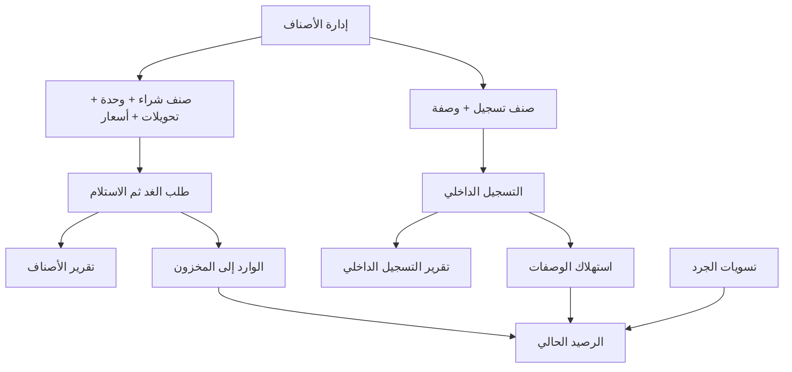
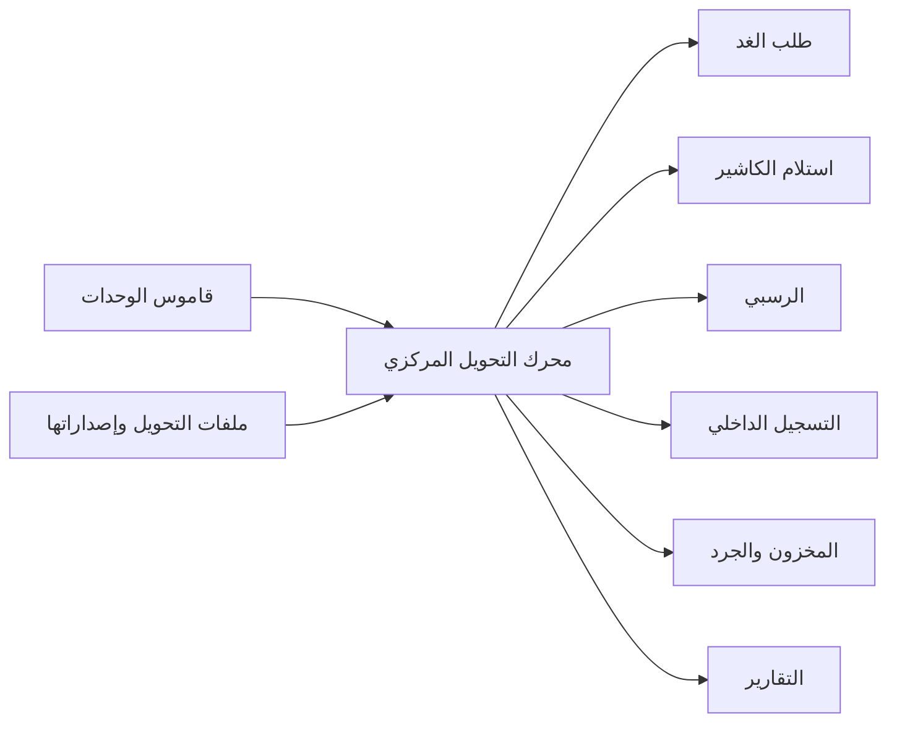

# المواصفة التنفيذية لبناء قسم «طلبات V4»

> حالة الوثيقة: مواصفة أعمال تنفيذية قيد التطوير؛ السلوك التشغيلي المتفق عليه مقدم على شوائب التنفيذ القديم  
> المنتج المستهدف: قسم جديد مستقل باسم «طلبات V4»  
> مصدر فهم السلوك وترحيل البيانات: المسار القديم `/orders` والقرارات التشغيلية المثبتة في هذه الوثيقة  
> حظر معماري: لا يعتمد تشغيل V4 على `/orders`؛ يبقى النظام القديم مصدر قراءة للترحيل والمطابقة فقط حتى اعتماد الإزالة النهائية.

## 1. الهدف من القسم

قسم «الطلبات» نواة تشغيلية مستقلة لضبط التكلفة وحركة الداخل والخارج. لا يعتمد سير عمله على أقسام النظام الأخرى، ويغطي خمس وظائف:

1. إعداد طلبات شراء الغد بلا فواتير وإرسالها إلى مندوب المشتريات.
2. تحديث الطلب نفسه عند وصول المشتريات بما استلمه الكاشير فعليًا، وضبط العهدة والمصروف والمتبقي.
3. تسجيل الموظف كل ما تم إخراجه/تنفيذه داخل قسمه تحت «التسجيل الداخلي» وإرساله عبر واتساب.
4. إدارة كتالوج أصناف الطلبات والتسجيل الداخلي وفئاتها وأحجامها ووحداتها وتحويلاتها ووصفاتها وآخر أسعارها.
5. احتساب المخزون من المواد المستلمة فعليًا ناقص استهلاك التسجيل الداخلي زائد تسويات الجرد، وإظهار تقارير الطلبات والتسجيل.

أي إعادة بناء مطابقة يجب أن تعيد هذه الدورة كاملة، لا أن تعيد شكل الجداول وحده.

## 2. قاموس المصطلحات

| المصطلح في الواجهة | المعنى التنفيذي | القيمة التقنية الحالية |
|---|---|---|
| طلب الغد | قائمة شراء تشغيلية بلا فاتورة ترسل للمندوب ثم يحدثها الكاشير عند الاستلام | `Order` |
| تسجيل داخلي | تسجيل كمية بيع/صرف تشغيلي لقسم في يوم معين | `StaffOrder.orderType = sale` |
| تسجيل | حركة موجبة تستهلك مواد الوصفة | `entryType = issue` |
| إلغاء تسجيل | حركة سالبة تعكس جزءًا من تسجيل سابق | `entryType = cancellation` |
| صنف شراء | مادة تدخل المخزون عند شرائها ويمكن استخدامها داخل وصفة | `OrderProduct.productType = order` |
| صنف تسجيل | منتج تشغيلي يتم تسجيله وتستهلك كميته مواد وصفته | `OrderProduct.productType = sale` |
| وحدة المخزون المختارة | الوحدة التي يحددها المستخدم كوحدة العمل الافتراضية للمخزون والجرد والرسبي | `inventoryUnitId` |
| الوحدة الحسابية الدنيا | أصغر وحدة نهائية في سلسلة المكوّن وتستخدم داخليًا لضمان دقة التحويل والتركيب | terminal/canonical unit |
| التحويل | علاقة عددية بين وحدتين للصنف المخزني | `fromUnit → toUnit × multiplier` |
| الرسبي/الوصفة | إصدار مكونات وكميات وتكلفة صنف التسجيل لكل وحدة مسجلة | `RecipeVersion` + `RecipeLine` |
| لقطة تاريخية | القيمة المحسوبة وقت الحركة لمنع تغيّر الماضي عند تعديل التحويل أو الوصفة | purchase/consumption snapshot |

## 3. خريطة القسم وعلاقات التبويبات



### التبويبات العليا في واجهة المدير

| المجموعة | التبويب الداخلي | الهدف |
|---|---|---|
| الطلبات | الطلبات | إعداد طلب الغد وإرساله، ثم تحديث الطلب نفسه بما استلمه الكاشير |
| التسجيل الداخلي | التسجيل الداخلي | إدخال عمليات البيع/الصرف التشغيلي بواسطة المستخدم الحالي |
| التقارير | تقرير الأصناف | تحليل بنود المشتريات والأسعار والكميات حسب الفترة |
| التقارير | تقرير التسجيل الداخلي | تحليل التسجيلات والتغطية اليومية حسب السجل والصنف والقسم والموظف واليوم |
| إدارة الأصناف | الأقسام، الفئات، الوحدات والتحويلات، الكتالوج | بناء البيانات المرجعية التي تعتمد عليها جميع الحركات |
| المخزون والتكلفة | المخزون والجرد | عرض الرصيد، جودة البيانات، إنشاء الجرد وسجله |

### واجهة الموظف

الموظف التشغيلي يرى «التسجيل الداخلي» فقط، ويفتح عليه مباشرة دون إظهار أي تبويب أو رابط آخر من القسم. لا يرى الطلبات أو التقارير أو إدارة الأصناف أو المخزون، ولا يرسل طلبات شراء.

يربط الموظف بقسمه في بيانات الصلاحيات. الخادم يستخرج القسم من هذا الربط ولا يقبل من الموظف تغيير `sectionId` أو إرسال تسجيل لقسم آخر. تعرض الواجهة اسم قسمه كمعلومة ثابتة بدل منتقي أقسام عام.

## 4. الصلاحيات والتوجيه

المالك و`super_admin` يملكان الوصول الكامل ضمن الشركة الحالية.

| الصلاحية | الأثر |
|---|---|
| `VIEW_ORDERS` | إظهار مدخل القسم في القائمة؛ لا تمنح بيانات المدير وحدها |
| `VIEW_INTERNAL_REGISTRATION` | إظهار مدخل التسجيل الداخلي |
| `ORDERS_READ` | عرض بيانات المدير: الطلبات، تقرير الأصناف، الإدارة، المخزون |
| `ORDERS_WRITE` | إنشاء/تعديل الطلبات والكتالوج والجرد |
| `ORDERS_DELETE` | إلغاء الطلب وحذف الوحدات/القوالب/الأقسام حيث تسمح القيود |
| `STAFF_ORDERS_SUBMIT` | إنشاء التسجيل الداخلي وعرض سجل المستخدم منه |
| `STAFF_ORDERS_READ` | عرض تقرير التسجيل الداخلي على مستوى الشركة |

قواعد التوجيه الإلزامية:

1. وجود `ORDERS_READ` أو `ORDERS_WRITE` أو `STAFF_ORDERS_READ` يفتح هيكل الإدارة، مع إخفاء التبويبات غير المصرح بها.
2. عدم وجود صلاحيات الإدارة مع وجود `STAFF_ORDERS_SUBMIT` يفتح واجهة التسجيل الداخلي للموظف فقط.
3. خلاف ذلك تظهر حالة منع وصول، ولا تُجلب بيانات القسم.
4. جميع الاستعلامات والكتابات مقيدة بـ`tenantId` و`companyId` النشطين.

## 5. التبويب الأول: الطلبات

### 5.1 الهدف

إعداد طلب شراء الغد وإرساله للمندوب، ثم استخدام الطلب نفسه لتسجيل ما وصل فعليًا عند استلام الكاشير. لا توجد فاتورة مشتريات ولا ينشأ مستند شراء ثانٍ. بعد الاستلام يصبح الطلب مصدر الوارد إلى المخزون ومصدر تقرير الطلبات.

### 5.2 أنواع الدفع

| الاسم الظاهر | القيمة | السلوك المالي |
|---|---|---|
| عهدة | `external` | يسمح بمبلغ عهدة، ويحسب مشتريات المندوب والمتبقي التراكمي |
| نقد | `internal` | لا يسمح بعهدة، ويجمع قيمة المشتريات النقدية الفعلية داخل القسم فقط |
| تحويل | `transfer` | لا يسمح بعهدة، ويظهر مجموع مستقل للتحويلات |

### 5.3 شريط الفترة والملخص

فلتر التاريخ مشترك ويدعم اليوم والشهر والنطاق. لا تدخل الطلبات الملغاة في أي رقم.

المعادلات:

```text
إجمالي العهدة             = Σ pettyCashAmount لطلبات external
مشتريات المندوب           = Σ totalAmount لطلبات external
رصيد المندوب              = إجمالي العهدة - مشتريات المندوب
المشتريات النقدية         = Σ totalAmount لطلبات internal
مشتريات التحويل           = Σ totalAmount لطلبات transfer
إجمالي المشتريات الفعلية  = Σ إجماليات الطلبات المستلمة
```

يستورد القسم **للقراءة والحساب فقط** إجمالي مبيعات المحل المسجلة نقدًا في قسم الفواتير/المبيعات خلال الفترة نفسها، ثم يطرح منها مشتريات الطلبات ذات طريقة الدفع `internal`. هذا الاستيراد لا يعد تكاملًا محاسبيًا ولا يكتب أي حركة أو تعديل أو خصم في الفواتير أو الخزائن أو دفتر الأستاذ؛ أثره محصور داخل ملخص طلبات V4 وتقاريره.

مصدر النقد المقصود هو مبالغ قنوات المبيعات النشطة المرتبطة بطريقة/خزنة نقدية، وليس إجمالي المبيعات بكل طرق الدفع. يجب وضع قراءة المصدر خلف بوابة قراءة مستقلة داخل V4 حتى لا تستورد خدمات الفواتير أو نماذجها الداخلية مباشرة، ولا تنشأ علاقات مفاتيح أجنبية من جداول V4 إلى جداول الفواتير.

```text
مبيعات المحل النقدية = Σ مبالغ مبيعات الفترة المسجلة على قناة نقدية
مشتريات نقد المحل    = Σ totalAmount لطلبات internal
المتبقي من النقد     = مبيعات المحل النقدية - مشتريات نقد المحل
```

المقصود بالداخل والخارج داخل هذه النواة هو: العهدة الداخلة للمندوب مقابل قيمة مشتريات العهدة الخارجة، والنقد المستورد للقراءة مقابل مشتريات المحل النقدية، والمواد الداخلة للمخزون مقابل استهلاك التسجيل الداخلي. أما التحويل فيعرض كمجموع مستقل لمشتريات `transfer` ولا يخصم من النقد ولا يغير رصيدًا بنكيًا خارج القسم.

المتبقي التراكمي لكل طلب عهدة يُحسب بترتيب الطلبات زمنيًا:

```text
المتبقي عند الطلب N = Σ العهد حتى N - Σ مشتريات العهدة حتى N
```

#### نظام وحاسبة العهدة

العهدة ليست حقلًا تجميليًا داخل الطلب، بل حساب فرعي مركزي داخل نواة طلبات V4 له دفتر حركات تشغيلي مستقل وقابل للتدقيق. هذا الدفتر داخلي للقسم وليس دفترًا محاسبيًا، ولا يرحل إلى الخزائن أو الفواتير أو الأستاذ العام. الطلب هو مصدر الحركة، ولا يجوز للواجهة أو التقرير إعادة تنفيذ معادلته بصورة مختلفة.

تعرض حاسبة العهدة داخل إنشاء طلب العهدة واستلامه القيم التالية:

1. الرصيد السابق قبل الطلب.
2. العهدة المضافة في الطلب الحالي.
3. إجمالي المشتريات المتوقع أثناء إعداد طلب الغد.
4. الرصيد المتوقع بعد تنفيذ الطلب.
5. إجمالي المشتريات الفعلي عند استلام الكاشير.
6. الرصيد الفعلي بعد الاستلام.

```text
الرصيد المتوقع = الرصيد السابق + عهدة الطلب - إجمالي الطلب المتوقع
الرصيد الفعلي  = الرصيد السابق + عهدة الطلب - إجمالي المشتريات الفعلية المستلمة
```

مثال:

```text
الرصيد السابق         = 500
العهدة الجديدة        = 1,000
المشتريات الفعلية     = 820
الرصيد الفعلي الجديد  = 500 + 1,000 - 820 = 680
```

قواعد الترحيل المالي للعهدة:

- عند حفظ طلب من نوع `external` تسجل حركة إضافة عهدة بقيمة `pettyCashAmount`، ويظل خصم المشتريات المتوقع للمعاينة فقط.
- لا تسجل حركة مشتريات عهدة فعلية قبل استلام الكاشير؛ عند الاستلام تسجل قيمة البنود الفعلية المستلمة كحركة خصم.
- طلبا `internal` و`transfer` لا ينشئان أي حركة في دفتر العهدة.
- إعادة تعديل أحدث طلب مستلم تستبدل أثر العهدة والمشتريات السابق بالفارق الصافي، ولا تجمع المبلغ مرتين.
- تغيير نوع الدفع من عهدة إلى نقد/تحويل يعكس حركات العهدة المرتبطة بالطلب ويمسح مبلغها.
- إلغاء طلب العهدة يعكس كل حركاته المنشورة مع إبقاء القيود الأصلية وقيود العكس للتدقيق.
- يسمح للرصيد أن يصبح سالبًا ويظهر كعجز واضح باللون الأحمر؛ لا يختفي ولا يتحول إلى صفر تلقائيًا.
- جميع الحركات تحمل مفتاح مصدر فريدًا يمنع الترحيل المكرر عند إعادة المحاولة أو النقر المزدوج.
- يحسب الخادم الرصيد داخل قفل على مستوى الشركة، ويعيد إلى الواجهة الرصيد السابق والمتوقع/الفعلي؛ قيمة الواجهة معاينة وليست مصدر الحقيقة.

دفتر العهدة يعرض: التسلسل، التاريخ والوقت، رقم الطلب، نوع الحركة، العهدة المضافة، المشتريات المخصومة، التعديل/العكس، الرصيد بعد الحركة، المستخدم والملاحظات. ويمكن فتح الطلب المصدر من كل حركة.

### 5.4 جدول الطلبات

الأعمدة بالترتيب:

1. رقم الطلب، وهو زر يفتح ورقة العرض.
2. تاريخ الطلب.
3. نوع الدفع كشارة.
4. عدد البنود.
5. مبلغ العهدة، أو شرطة لغير العهدة.
6. إجمالي الطلب.
7. المتبقي التراكمي للعهدة، أخضر للموجب وأحمر للسالب.

فوق الجدول توجد أزرار فلترة: الكل، عهدة، نقد، تحويل. يتغير إجمالي الصفوف الظاهرة وتذييل الجدول مع الفلتر، بينما يبقى ملخص الفترة شاملًا.

على الشاشات الضيقة تتحول الصفوف إلى بطاقات قابلة للنقر تعرض الرقم والنوع والتاريخ وعدد البنود والإجمالي والعهدة والمتبقي.

### 5.5 إنشاء طلب الغد

النموذج ورقة جانبية، وليس صفحة مستقلة. الحقول:

- تاريخ الطلب المطلوب، والافتراضي يوم غد حسب توقيت السعودية مع السماح بتغييره للمخول.
- نوع الدفع.
- مبلغ العهدة، ويظهر/يُحفظ للعهدة فقط.
- أصناف الطلب.
- الملاحظات الاختيارية.

منتقي الأصناف عقد واجهة إلزامي:

1. الأقسام تظهر كأزرار اختيار.
2. الأصناف تظهر كشبكة أزرار/بطاقات POS، وليست قائمة منسدلة أو جدولًا.
3. البطاقة تعرض اسم الصنف وآخر سعر، وتظهر كمية مختارة وشارة تحديد عند إضافته.
4. النقر يفتح اختيار الوحدة المسعرة/المتغير والكمية والسعر.
5. لا يمكن اختيار وحدة سعر غير متصلة بوحدة المخزون عبر التحويلات.
6. البحث يعمل على الاسم العربي والإنجليزي.
7. يمكن تعديل الصنف والوحدة والكمية والسعر من جدول المسودة وحذف السطر.
8. شريط الإجمالي يتحدث لحظيًا.

عند الإنشاء تمثل البنود الكميات المطلوبة والأسعار المتوقعة المبنية على آخر سعر، ثم يرسل الطلب للمندوب عبر واتساب. لا تعد الكميات مخزونًا مستلمًا لمجرد إعداد الطلب.

### 5.6 استلام الطلب وتحديثه

عند وصول المندوب يفتح الكاشير **نفس الطلب** من جدول الطلبات ويدخل إلى التعديل. لا يوجد زر «اعتماد استلام» مستقل؛ نجاح حفظ تعديل الكاشير هو حدث الاستلام ويثبت `receivedAt` و`receivedByUserId` تلقائيًا.

التعديل مفتوح لأحدث طلب فقط داخل الشركة الحالية، ويحدد الخادم الأحدث بترتيب `createdAt DESC, id DESC`. لا يكفي إخفاء زر التعديل في الواجهة؛ يرفض الخادم تعديل أي طلب أقدم حتى لو استُدعي المسار مباشرة.

حالات الدورة الدنيا:

| الحالة | معناها | أثر المخزون |
|---|---|---|
| `pending_receipt` | طلب الغد منشأ وقد يرسل للمندوب، ولم يحفظ الكاشير استلامه بعد | لا أثر |
| `received` | حفظ الكاشير تعديل الطلب بنجاح | ترحيل البنود الفعلية |
| `cancelled` | ألغي الطلب مع حفظه رقابيًا | لا أثر، ويعكس أثره السابق إن كان مستلمًا |

فتح واتساب أو إعادة الإرسال ليس اعتمادًا للاستلام ولا يغير `pending_receipt` إلى `received`.

يحدث الكاشير أحدث طلب كما يلي:

1. يثبت الكميات التي وصلت فعليًا.
2. يصحح الحجم والتغليف والوحدة حسب المستلم.
3. يسجل سعر الشراء الفعلي.
4. يحذف/يصفر ما لم يصل، ويضيف البديل الذي وصل إن وجد.
5. يثبت العهدة المصروفة وطريقة الدفع والملاحظات.
6. يحفظ الطلب؛ فيعتبر مستلمًا تلقائيًا وتتحول بنوده إلى الحقيقة الفعلية التي تعتمدها التكلفة والتقرير والمخزون وآخر الأسعار.

لا ينشأ طلب جديد ولا فاتورة ولا سند استلام منفصل. يجب أن يحتفظ النظام بتاريخ الطلب الأصلي ووقت/مستخدم آخر تحديث استلام لأغراض الرقابة.

قواعد احتساب البنود الفعلية بعد الاستلام:

```text
amount(line) = quantity × unitPrice
totalAmount  = Σ amount(line)
inventoryBaseQuantitySnapshot = quantity × resolvedMultiplierToBaseUnit
```

- الكمية موجبة ويجب وجود بند واحد على الأقل.
- الخادم يعيد حساب السطر والإجمالي ولا يثق بإجمالي الواجهة.
- إذا لم يوجد مسار تحويل من وحدة السطر إلى وحدة مخزون الصنف يرفض الحفظ.
- رقم الطلب ينشأ ذريًا بصيغة `ORD-YYYYMMDD-NNN` داخل قفل خاص بالشركة واليوم.
- عند الحفظ يتحدث آخر سعر للمتغير المطابق `(size, packaging, unit)`، أو `product.lastPrice` للصنف البسيط.
- تعديل الاستلام يقفل الطلب، ويتحقق داخل القفل أنه ما زال أحدث طلب، ثم يستبدل البنود ذريًا ويعيد اللقطات والإجمالي ولا يغير رقم الطلب.
- أول حفظ للكاشير يضيف الكميات الفعلية إلى المخزون. إذا أعاد الكاشير تعديل أحدث طلب مستلم، تعكس المعاملة أثر الاستلام السابق ثم ترحل الأثر الجديد، أو ترحل الفرق الصافي فقط؛ يمنع جمع الكمية مرتين.
- عند إنشاء طلب أحدث يصبح كل طلب أقدم غير قابل للتعديل، وتبقى إمكانية العرض والطباعة والإرسال فقط.
- تغيير النوع من عهدة إلى نوع آخر يصفر/يمسح مبلغ العهدة.

### 5.7 العرض والإجراءات

ورقة عرض الطلب تعرض بيانات الرأس وجدول البنود: الصنف/المتغير، الكمية، سعر الوحدة، الإجمالي. الإجراءات:

- طباعة أو PDF.
- تصدير Excel لطلب واحد.
- إرسال نص الطلب عبر واتساب.
- تعديل.
- إلغاء بعد نافذة تأكيد.

«الحذف» هنا إلغاء منطقي: `status = cancelled`. لا يُحذف السجل، وتستبعده القوائم والتقارير والمخزون.

## 6. حدود الدور التشغيلي للموظف

لا يوجد مسار «طلبات أقسام» للموظف في المواصفة المستهدفة. الموظف لا ينشئ طلب شراء ولا يرى طلبات الغد أو عهدة المندوب. مسؤوليته الوحيدة داخل هذه النواة هي إدخال ما تم إخراجه/تنفيذه في قسمه من خلال التسجيل الداخلي وإرسال السجل عبر واتساب.

أي صلاحية أو واجهة قديمة تسمح للموظف بإنشاء `StaffOrder.orderType = order` تعد أثرًا قديمًا خارج سير العمل المستهدف ويجب عدم نقلها إلى إعادة البناء.

## 7. التسجيل الداخلي

### 7.1 الهدف

تسجيل كمية البيع/الصرف التشغيلي الفعلية حسب القسم واليوم. التسجيل يغذي تقرير التسجيل الداخلي ويخصم مواد الرسبي من المخزون.

### 7.2 شكل الواجهة

- مساحة فرعية «إدخال» ومساحة «السجل» على شكل أزرار تبويب.
- قسم الموظف إلزامي لكنه مستخرج من ربط المستخدم بالقسم؛ يظهر ثابتًا ولا يستطيع الموظف تغييره.
- بحث، ثم شبكة أصناف تسجيل على شكل أزرار/بطاقات POS.
- الأسعار لا تظهر في سلة الموظف، حتى لو استخدمت داخليًا في التقرير.
- السلة تعرض الصنف والمتغير وأزرار `− / الكمية / +` والحذف.
- تاريخ التسجيل، ملاحظة اختيارية، زر حفظ بعرض واضح، ثم زر إلغاء النموذج.

### 7.3 التسجيل الموجب

القواعد:

1. كل عملية تسجيل تخص قسم الموظف المصرح له بالضبط؛ لا يقبل الخادم قسمًا آخر حتى لو عُدلت الحمولة يدويًا.
2. التاريخ الافتراضي يقترح اليوم التالي لآخر تسجيل موجب للقسم، ولا يتجاوز تاريخ اليوم.
3. يعرض النظام الرقم التالي للمعاينة، ثم يحجز الرقم الحقيقي وقت الحفظ.
4. صيغة الرقم الحالية `DD-MM-YYYY-A` ثم `B...Z, AA...` لعمليات اليوم نفسه، ويُنشأ تحت قفل مخزون/عملية لمنع التكرار.
5. السجل يحفظ مباشرة بحالة `sent` ويولّد نص واتساب.
6. لكل سطر تُلتقط كمية الوحدة المباعة واستهلاكات مواد الوصفة وقت الحفظ.
7. إذا تسبب الحفظ في رصيد مادة سالب، يعيد الخادم نقص المواد ويطلب تأكيدًا صريحًا؛ إعادة الحفظ فقط ترسل `allowNegativeInventory = true`.

### 7.4 الإلغاء

الإلغاء حركة رقابية مستقلة، وليس حذفًا للتسجيل السابق:

- متاح للتسجيل الداخلي فقط.
- يختار المستخدم وضع الإلغاء من زر واضح أحمر.
- أسباب الإلغاء إلزامية، ويمكن اختيار أكثر من سبب: لم يعجب العميل، استُبدل بصنف آخر، خطأ في الطلب، خطأ في التسجيل، تأخر الطلب، طلب مكرر، العميل غيّر رأيه، الصنف غير متوفر، أخرى. القيم المحفوظة بالترتيب هي: `customer_disliked`, `replaced_item`, `order_error`, `registration_error`, `delayed_order`, `duplicate_order`, `customer_changed_mind`, `item_unavailable`, `other`.
- عند اختيار «أخرى» تُطلب ملاحظة مختصرة لذلك السطر.
- لا يجوز أن تتجاوز الكمية الملغاة الكمية الصافية المسجلة لنفس الصنف والمتغير والقسم والتاريخ.
- تحفظ كمية السطر سالبة.
- تُعكس لقطة الاستهلاك التاريخية بنسبة الكمية الملغاة، لا الوصفة الحالية.
- سجل الإلغاء غير قابل للتعديل أو الحذف.

### 7.5 التعديل والحذف والسجل

- المستخدم يرى سجلاته فقط خلال نافذة 30 يومًا.
- في التسجيل الداخلي يمكن تعديل أو حذف آخر سجل للمستخدم فقط.
- المالك و`super_admin` مستثنيان من قيد «الأخير» لكن لا يمكنهما تعديل/حذف سجل إلغاء.
- لا يجوز تعديل أو حذف سجل مستخدم آخر من هذه الواجهة.
- تعديل التسجيل يستبدل بنوده ذريًا ويعيد فحص الرصيد واللقطات.
- إعادة الإرسال تجمع كل سجلات رقم العملية نفسه إن وجدت وتعيد إنشاء نص واتساب.

## 8. مجموعة التقارير

### 8.1 تقرير الأصناف

#### الهدف والمصدر

تحليل بنود طلبات المشتريات النشطة داخل الفترة. المصدر هو `OrderItem` المرتبط بطلب `status = active` فقط.

#### الفلاتر

- بحث باسم الصنف أو الفئة.
- أقسام متعددة.
- فئات متعددة.
- وحدات متعددة.
- تغليفات متعددة.
- طرق دفع متعددة: عهدة/نقد/تحويل.
- مقياس الرسم والترتيب: المبلغ، الكمية المعيارية، عدد الطلبات.
- عرض الكل أو الأعلى أو الأقل، بعدد من 1 إلى 100.
- زر إعادة الضبط.

#### المؤشرات والرسوم

- إجمالي المبلغ بعد الفلاتر.
- عدد الطلبات الفعلية المميزة، لا عدد البنود.
- عدد الأصناف المميزة.
- عدد الأقسام الظاهرة.
- مقارنة الأقسام بأشرطة أفقية.
- اتجاه يومي بخط مستقل لكل قسم.
- أعلى خمسة أصناف داخل كل قسم.

الصنف المرتبط بأكثر من قسم يوضع في مجموعة «مشترك» في إجماليات المقارنة لمنع مضاعفة المبلغ. الصنف بلا قسم يوضع «غير محدد».

#### الجدول

الأعمدة:

1. القسم/الأقسام.
2. الصنف، كزر يفتح تاريخ شراء الصنف.
3. الفئة، كزر يفتح تاريخ شراء الفئة.
4. الحجم/التغليف.
5. الوحدة المسجلة.
6. الكمية المسجلة.
7. الكمية المعيارية مع وحدة المخزون.
8. المبلغ.
9. عدد الطلبات المميزة.
10. متوسط سعر الوحدة.
11. تاريخ آخر شراء.

التصدير Excel والطباعة/PDF يعكسان النتائج المعروضة بعد الفلاتر والترتيب. إذا كانت كل الكميات المعيارية بوحدة واحدة يظهر مجموعها في التذييل، وإلا يظهر «وحدات متعددة».

### 8.2 تقرير التسجيل الداخلي

#### الهدف والمصدر

تحليل جميع سجلات `StaffOrder.orderType = sale` في الفترة. تاريخ السجل هو `saleDate`، مع الرجوع إلى `createdAt` للسجلات القديمة. حركات الإلغاء السالبة تدخل الحساب طبيعيًا.

#### تعريف العملية

السجلات التي تحمل `logRef` واحدًا تعد عملية واحدة حتى لو وُجدت كسجلات أقسام متعددة. عند غياب الرقم يستخدم مفتاح مستقر مشتق من السجل.

#### المؤشرات

```text
إجمالي العمليات = عدد مفاتيح العمليات المميزة
إجمالي الكمية   = Σ quantities بما فيها الإلغاء السالب
إجمالي المبلغ   = Σ سعر السطر × الكمية
متوسط العملية   = إجمالي المبلغ ÷ عدد العمليات
```

إضافة إلى عدد الأصناف المميزة والأقسام المميزة.

#### طرق العرض

| العرض | الأعمدة/المعنى |
|---|---|
| حسب السجل | الرقم، التاريخ، المستخدم، عدد الأقسام، الكمية، المبلغ، المتوسط، أسماء الأقسام |
| الأيام الناقصة | التاريخ، القسم، حالة «غير مسجل» |
| حسب الصنف | الصنف، الكمية، الوحدة، الأقسام |
| حسب القسم | القسم، الكمية، عدد سجلات القسم، المبلغ، متوسط المبلغ لكل كمية |
| حسب الموظف | الموظف، عدد العمليات المميزة، الكمية |
| حسب اليوم | اليوم، عدد العمليات المميزة، الكمية |

يوجد رسم أعمدة يومي بسيط للكمية.

#### تغطية التسجيل

- التغطية تعتمد التسجيلات الموجبة `entryType = issue` فقط.
- بداية التوقع لكل الأقسام هي أول يوم بدأ فيه التسجيل على مستوى الشركة، أو بداية الفلتر أيهما أحدث.
- نهاية التوقع هي نهاية الفلتر أو اليوم الحالي أيهما أسبق؛ لا تُحسب أيام مستقبلية.
- لكل قسم يحسب: الأيام المتوقعة، المسجلة، الناقصة، أول وآخر تسجيل.
- يعرض ملخص عدد أيام-الأقسام الناقصة وعدد الأقسام المتأثرة وجدول الأيام الناقصة.

## 9. إدارة الأصناف

### 9.1 الأقسام

الحقول: الاسم العربي، الاسم الإنجليزي الاختياري، الترتيب.

العلاقات:

- تصفية منتقي الأصناف.
- تصفية وتنظيم أصناف طلبات الغد.
- فرض قسم واحد للتسجيل الداخلي.
- تصنيف تقارير المشتريات والتسجيل.
- تصفية المخزون.

اسم القسم العربي هو المفتاح التشغيلي الظاهر في سجلات الموظفين، مع حفظ `sectionIds` و`sections` في الصنف للتوافق. يجب منع تكرار الاسم بعد التطبيع. عند إعادة التسمية تتحدث أسماء الأقسام داخل الأصناف. عند حذف القسم تزال مراجعه من الأصناف ولا تُحذف الحركات التاريخية.

### 9.2 الفئات

الحقول: الاسم العربي، الاسم الإنجليزي الاختياري، الترتيب، الحالة.

الوظائف: إنشاء/تعديل، عرض أصناف الفئة، بحث، استيراد Excel، ترجمة الأسماء الناقصة، تحديد جماعي وتعطيل. تستخدم الفئة لتنظيم الكتالوج وفلاتر تقرير الأصناف وتاريخ شراء الفئة. التعطيل هو المسار المعتاد بدل الحذف الصلب.

### 9.3 الوحدات والتحويلات

#### المبدأ المعماري

الوحدات ومعاملات التحويل نواة مركزية واحدة تستخدمها الطلبات والاستلام والتسجيل الداخلي والرسبي والمخزون والتقارير والجرد. يمنع إنشاء دالة تحويل أو معامل موازٍ داخل أي تبويب أو خدمة أخرى.



أي كمية تدخل النظام تمر بالعقد المركزي نفسه:

```text
normalize(itemId, quantity, fromUnit, conversionVersion?)
→ baseUnit, baseQuantity, multiplier, conversionPath, conversionVersionId
```

#### قاموس الوحدات المركزي

حقول الوحدة: `code`, `nameAr`, `nameEn`, `kind`, `sortOrder`, `isActive`, `isDefault`.

الوحدات الافتراضية عند أول تشغيل:

- وحدات: `piece`, `kg`, `g`, `l`, `ml`.
- عبوات: `box`, `pack`, `half_pack`, `carton`, `dozen`, `bottle`, `cup`.

رمز الوحدة فريد ومستقر. تعديل الاسم أو الترجمة لا يغير الرمز ولا يكسر التاريخ. لا تحذف وحدة مستخدمة؛ تعطل فقط بعد فحص التبعيات.

#### ملفات التحويل

لا تحفظ معاملات متفرقة داخل الشاشات. ينشأ «ملف تحويل» مركزي قابل لإعادة الاستخدام، وله:

- اسم ورمز ووصف.
- وحدة أساس واحدة.
- نطاق: قياسي، عائلة أصناف، أو صنف محدد.
- إصدار منشور حالي.
- صفوف التحويل.
- حالة وتاريخ نشر ومن أنشأه.

التحويلات القياسية الافتراضية:

- `kg → g × 1000`.
- `l → ml × 1000`.
- `dozen → piece × 12`.

التحويل القياسي يصلح لكل الأصناف، أما تحويلات العبوات فتتبع ملف الصنف/العائلة لأن عدد الحبات في الكرتون أو العلبة قد يختلف بين صنف وآخر.

#### قاعدة التحويل الملزمة

لكل صف:

```text
1 fromUnit = multiplier toUnit
```

مثال:

```text
1 carton = 10 pack
1 pack   = 24 piece
إذن 2 carton = 2 × 10 × 24 = 480 piece
```

محرك التحويل المركزي:

1. يطبع أسماء الوحدات ومرادفاتها إلى رمز موحد.
2. يضيف تلقائيًا التحويلين القياسيين `kg↔g` و`l↔ml`.
3. يحول كل صف إلى حافتين: مباشرة، وعكسية بمقلوب المعامل.
4. يبحث عن مسار متسلسل من وحدة الحركة إلى وحدة مخزون الصنف.
5. يضرب معاملات المسار بالترتيب.
6. لا يستخدم الحجم أو اسم التغليف أو `quantityMultiplier` القديم كمصدر تحويل للحركات الجديدة.

كل المستهلكين يستخدمون النتيجة نفسها:

- طلب الغد: يعرض كمية وتكلفة متوقعة فقط.
- استلام الكاشير: يثبت الكمية الأساسية الفعلية ويربطها بإصدار التحويل.
- الرسبي: يحول وحدة مكون الوصفة إلى وحدة مخزون المادة.
- التسجيل الداخلي: يضرب كمية البيع الأساسية في مكونات الرسبي المحولة.
- المخزون: يجمع اللقطات الأساسية ولا يعيد اختراع التحويل.
- التقارير: تعرض الكمية المسجلة والكمية الأساسية من المصدر المركزي نفسه.
- الجرد: يقبل الوحدات المعرفة للمكوّن ويحولها مركزيًا، مع إبراز وحدة المخزون المختارة كافتراضية.

#### سهولة التعديل والصيانة

تعديل المعادلة لا يعدل الإصدار المنشور في مكانه. ينشئ النظام مسودة إصدار جديد، ثم:

1. يتحقق من صحة جميع المسارات.
2. يعرض الأصناف والوصفات ووحدات الأسعار المتأثرة.
3. يعرض أمثلة قبل/بعد لكميات حقيقية.
4. يمنع النشر إذا انقطعت وحدة سعر أو وصفة عن وحدة المخزون.
5. ينشر الإصدار للحركات المستقبلية فقط.
6. يحتفظ بالحركات السابقة على إصدارها ولقطتها الأصلية.

لذلك يمكن تغيير `1 carton = 10 pack` إلى `1 carton = 12 pack` دون تغيير مخزون أو تكلفة أي استلام سابق.

واجهة الإدارة المركزية توفر: بحثًا، نسخ ملف، إنشاء مسودة، مقارنة إصدارين، معاينة الأثر، نشرًا، إيقافًا، وسجل تغييرات. لا يسمح بتحرير معامل من نموذج الطلب أو شاشة المخزون.

قواعد التحقق:

- المعامل رقم موجب.
- المصدر والهدف مختلفان.
- يمنع تكرار الزوج أو عكسه.
- يمنع وجود هدفين مختلفين للمصدر نفسه داخل السلسلة.
- يمنع الدوران.
- يمنع مخالفة `kg/g` و`l/ml` القياسية.
- كل صف وكل وحدة سعر يجب أن تكون متصلة بوحدة مخزون الصنف.
- لا يجوز تعطيل ملف مستخدم أو كسر تحويل تعتمد عليه وصفة فعالة دون معالجة التبعيات أولًا.
- الحساب عشري بدقة ثابتة ولا يستخدم `float`.
- النتيجة تحفظ مع `conversionVersionId` والمسار والمعامل والكمية الأساسية كلقطة قابلة للتدقيق.

#### بطاقة المكوّن: التبويبات الثلاثة

صنف الطلب الذي يمكن استخدامه مكوّنًا في الرسبي يفتح في بطاقة/ورقة واحدة تحتوي ثلاثة تبويبات فقط:

1. «معلومات عامة».
2. «السعر».
3. «الوحدات».

##### تبويب معلومات عامة

يحتوي هوية المكوّن فقط: الاسم العربي، الاسم الإنجليزي، الفئة، الأقسام، الحالة، الترتيب والملاحظات. لا تحفظ داخله معاملات تحويل أو أسعار.

##### تبويب الوحدات

هذا هو مصدر وحدات المكوّن ومعادلاته. يبدأ المستخدم بزر `+` ثم:

1. يختار الوحدة الأولى، مثل «كرتون»، ويحفظها بلا وحدة أب.
2. يضغط `+` ويختار «علبة».
3. يربط العلبة بالكرتون ويدخل معامل الاحتواء: `1 كرتون = 10 علب`.
4. يضغط `+` ويختار «حبة».
5. يربط الحبة بالعلبة ويدخل المعامل: `1 علبة = 64 حبة`.

تمثل كل وصلة الحقول التالية:

| الحقل | المعنى |
|---|---|
| `unitId` | الوحدة المضافة، مثل حبة |
| `parentUnitId` | الوحدة التي تحتويها، مثل علبة |
| `unitsPerParent` | عدد الوحدات المضافة داخل وحدة الأب، مثل 64 |
| `sortOrder` | ترتيبها الظاهر في السلسلة |

السلسلة الناتجة:

```text
1 كرتون = 10 علب
1 علبة   = 64 حبة
1 كرتون = 10 × 64 = 640 حبة
```

تعرض الواجهة السلسلة بصريًا من الوحدة الأكبر إلى الأصغر، مع نتيجة محسوبة للقراءة فقط عند كل مستوى. لا يدخل المستخدم معاملًا مباشرًا بين الكرتون والحبة لأن المحرك يستنتجه من المسار.

قواعد واجهة الوحدات:

- الوحدة الأولى فقط يمكن أن تكون بلا أب.
- كل وحدة لاحقة ترتبط بوحدة موجودة داخل المكوّن نفسه.
- لا تكرر الوحدة داخل المكوّن.
- المعامل أكبر من صفر.
- يمنع الدوران والفروع المتعارضة والمسار المنقطع.
- يمكن تعيين أي وحدة فعالة داخل السلسلة كوحدة مخزون من زر اختيار واحد `وحدة المخزون`؛ لا يمكن وجود أكثر من وحدة مخزون مختارة للمكوّن.
- تظهر وحدة المخزون المختارة بشارة واضحة داخل السلسلة وتصبح الوحدة الافتراضية في المخزون والجرد واختيار وحدة مكوّن الرسبي.
- تغيير الأب أو المعامل ينشئ إصدار تحويل جديدًا بعد معاينة الأثر.
- حذف وحدة مستخدمة في سعر أو رسبي أو حركة تاريخية ممنوع؛ يمكن تعطيلها للحركات الجديدة بعد معالجة التبعيات.

##### تغيير وحدة المخزون

تغيير وحدة المخزون متاح من تبويب الوحدات ولا يحتاج تعديل الطلبات أو المخزون يدويًا. عند اختيار وحدة أخرى يعرض النظام قبل الحفظ:

- الوحدة الحالية والجديدة.
- الرصيد الحالي بالوحدتين وبالصيغة المركبة.
- الأسعار والوصفات والجرد المتأثر.
- أي كسور أو مسارات غير مكتملة.

بعد التأكيد ينشر النظام إصدار تعريف جديدًا للحركات المستقبلية. لا يعيد تفسير الحركات القديمة؛ كل حركة تحتفظ بوحدتها وإصدار تحويلها وكميتها الحسابية الأصلية. تتحول الأرصدة الحالية حسابيًا دون فقد أو زيادة في الكمية.

مثال: إذا كان الرصيد الحسابي `1,490 حبة` والسلسلة `1 كرتون = 10 علب` و`1 علبة = 64 حبة`، فإن تغيير وحدة المخزون من «حبة» إلى «علبة» لا يغير الرصيد الحقيقي، وإنما يغير الوحدة الافتراضية إلى `23.28125 علبة` بينما يبقى العرض المركب `2 كرتون + 3 علب + 18 حبة`.

##### تبويب السعر

تبويب السعر يستورد الوحدات المعرفة في تبويب الوحدات ولا يسمح بكتابة وحدة حرة. يبدأ المستخدم بزر `+` ثم يختار إحدى وحدات المكوّن ويدخل سعرها.

- يمكن إضافة سعر لأكثر من وحدة، مثل سعر الكرتون وسعر العلبة وسعر الحبة.
- لكل وحدة صف سعر مستقل؛ لا يحسب سعر وحدة تلقائيًا من سعر وحدة أخرى لأن سعر العبوة قد يتضمن خصمًا مختلفًا.
- الوحدات التي لها سعر فعّال فقط هي التي تظهر كخيارات شراء داخل طلب الغد.
- السعر الظاهر في الطلب هو آخر سعر محفوظ للوحدة المختارة.
- عند استلام الكاشير وتسجيل السعر الفعلي، يتحدث آخر سعر للوحدة نفسها فقط.
- تحديث سعر الكرتون لا يغير سعر العلبة أو الحبة تلقائيًا.
- يحتفظ النظام بتاريخ أسعار كل وحدة: السعر السابق، الجديد، مصدر التحديث، الطلب، المستخدم والوقت.
- تعديل السعر يدويًا أو تحديثه من الاستلام يؤثر في الطلبات المستقبلية فقط، ولا يغير طلبًا مستلمًا سابقًا.

إذا لم توجد وحدات، يعرض تبويب السعر حالة فارغة وزرًا ينقل المستخدم إلى تبويب الوحدات. وإذا أضيفت أو عطلت وحدة، يتحدث منتقي السعر مباشرة من المصدر نفسه.

### 9.4 الكتالوج

يوجد نوعان منفصلان داخل الكتالوج:

#### صنف شراء `order`

- الاسم العربي إلزامي والإنجليزي اختياري.
- الفئة والأقسام.
- بطاقة من ثلاثة تبويبات: معلومات عامة، السعر، الوحدات.
- سلسلة وحدات المكوّن من الأكبر إلى الأصغر ومعامل احتواء بين كل مستويين.
- أسعار مستقلة لوحدة واحدة أو أكثر من وحدات السلسلة.
- ارتباط سلسلة الوحدات بإصدار محرك التحويل المركزي؛ لا تحفظ معادلات مستقلة في الطلب أو المخزون.
- لا يحمل وصفة.

#### صنف تسجيل `sale`

- بطاقة من ثلاثة تبويبات: معلومات عامة، السعر، الرسبي.
- تبويب السعر يدير سعر/خيارات صنف التسجيل بصورة مستقلة عن أسعار مكوناته.
- تبويب الرسبي يبني مكونات الصنف من أصناف الطلبات الفعالة ووحداتها المركزية.
- لا يحمل تحويلات مخزون خاصة به باعتباره مادة مخزنية.

وظائف الكتالوج: بحث، فلترة بالنوع/القسم/الفئة، إنشاء وتعديل، تحديد جماعي، إضافة/استبدال الأقسام جماعيًا، تعطيل جماعي، استيراد وتصدير Excel، تنزيل قالب، طباعة الكتالوج، طباعة أسبوعية، معاينة/تطبيق الترجمات الناقصة، وإضافة كتالوج جاهز حيث تتوفر الوظيفة.

لا يوجد حذف صلب اعتيادي للصنف؛ يعطل عبر `isActive = false` حفاظًا على التاريخ.

## 10. إنشاء الرسبي

### 10.1 بطاقة صنف التسجيل

صنف البيع/التسجيل يفتح في بطاقة أو ورقة واحدة بثلاثة تبويبات فقط:

1. «معلومات عامة»: الاسم، الفئة، القسم، الحالة، الترتيب والملاحظات.
2. «السعر»: سعر أو خيارات سعر صنف التسجيل المستخدمة في التقارير، ولا تظهر للموظف داخل سلة التسجيل.
3. «الرسبي»: مكونات الصنف وكمياتها وتكلفتها.

### 10.2 إضافة مكوّن إلى الرسبي

داخل تبويب الرسبي يوجد زر `+ إضافة مكوّن`. عند الضغط:

1. تفتح قائمة أصناف الطلبات/المكونات الفعالة فقط.
2. تحتوي القائمة بحثًا بالاسم العربي والإنجليزي والفئة.
3. يختار المستخدم المكوّن.
4. بعد الاختيار يجلب النظام وحدات هذا المكوّن من تبويب وحداته المركزي.
5. يختار المستخدم الوحدة، مثل كرتون أو علبة أو حبة أو كجم أو جرام.
6. يدخل كمية استهلاك المكوّن لكل وحدة تسجيل واحدة من صنف البيع.
7. يعرض النظام فورًا الكمية المحولة إلى وحدة المخزون وتكلفة السطر.
8. يضغط «حفظ» فيضاف السطر إلى الرسبي.
9. يمكن الضغط على `+` مرة أخرى وإضافة مكوّن آخر بالطريقة نفسها.

لا يسمح بكتابة اسم مكوّن أو وحدة يدويًا. المكوّن مرجع حقيقي لصنف طلب، والوحدة مرجع حقيقي من وحداته الفعالة.

### 10.3 سطر الرسبي

كل سطر يحتوي:

| الحقل | القاعدة |
|---|---|
| `materialProductId` | صنف طلب/مكوّن فعّال من الشركة نفسها فقط |
| `materialUnitId` | وحدة فعالة من سلسلة وحدات المكوّن المحدد |
| `quantity` | رقم عشري موجب يمثل استهلاك المكوّن لكل وحدة تسجيل واحدة |
| `conversionVersionId` | إصدار تحويل المكوّن المستخدم عند حفظ إصدار الرسبي |
| `normalizedQuantity` | الكمية المحولة إلى الوحدة الحسابية للمكوّن |
| `estimatedUnitCost` | متوسط تكلفة الوحدة الحسابية من آخر خمسة طلبات مستلمة |
| `estimatedLineCost` | `normalizedQuantity × estimatedUnitCost` |

بعد الحفظ يظهر السطر داخل جدول الرسبي: اسم المكوّن، الكمية، الوحدة، الكمية المحولة، تكلفة السطر، تعديل، حذف.

### 10.4 إجمالي تكلفة الرسبي

#### مصدر تكلفة المكوّن

تكلفة المكوّن لا تعتمد آخر سعر منفردًا ولا متوسط المخزون الكامل؛ تعتمد متوسط سعر آخر خمسة طلبات مستلمة فعليًا تحتوي المكوّن.

خطوات الحساب لكل مكوّن:

1. يجلب آخر خمسة طلبات بحالة `received` تحتوي المكوّن، مرتبة بـ`receivedAt DESC` ثم `id DESC`.
2. يستبعد طلب الغد غير المستلم والطلب الملغى.
3. يوحد كل سعر إلى الوحدة الحسابية للمكوّن بواسطة إصدار التحويل المحفوظ في سطر الاستلام.
4. إذا تكرر المكوّن في الطلب نفسه، يجمع مبلغ أسطره وكمياتها الحسابية أولًا ليصبح لذلك الطلب سعر وحدة واحد.
5. يحسب المتوسط الحسابي لأسعار الوحدة الناتجة للطلبات الخمسة.

```text
orderUnitCost = Σ lineAmountForMaterialInOrder ÷ Σ normalizedQuantityForMaterialInOrder
rolling5UnitCost = Σ orderUnitCost ÷ numberOfAvailableReceivedOrders
```

إذا توفرت ثلاثة طلبات فقط، يستخدم متوسط الثلاثة. إذا لم يوجد أي طلب مستلم للمكوّن، تكون التكلفة «غير مكتملة» ولا تستخدم قيمة آخر سعر اليدوي بديلًا صامتًا.

مثال بعد توحيد الكرتون والعلبة والحبة إلى الحبة:

```text
تكلفة الحبة في آخر خمسة طلبات:
0.48, 0.50, 0.46, 0.52, 0.49

متوسط آخر 5 = 0.49 للحبة
```

عند استلام طلب جديد يدخل في النافذة ويخرج أقدم طلب منها. وعند تعديل أحدث طلب مستلم أو إلغائه يعاد بناء النافذة والمتوسط، مع أخذ الطلب الأقدم التالي عند الحاجة.

آخر سعر لكل وحدة يبقى مستخدمًا كاقتراح داخل طلب الغد، أما متوسط آخر خمسة طلبات فهو المستخدم في تكلفة الرسبي.

#### تكلفة الرسبي

أسفل قائمة المكونات يظهر ملخص حي:

```text
تكلفة الرسبي للوحدة = Σ تكلفة جميع سطور المكونات
```

إذا تعذر تحديد تكلفة مكوّن، لا يعتبره النظام صفرًا بصمت؛ يظهر السطر بحالة «تكلفة غير مكتملة» ويعرض المكوّن الناقص. السعر الموجود في تبويب سعر صنف التسجيل منفصل عن تكلفة الرسبي.

عند كل تسجيل داخلي تحفظ لقطة متوسط التكلفة المستخدم مع معرفات الطلبات التي كوّنت نافذة الخمسة. وصول طلب سادس يغير التكلفة الحالية والمستقبلية، لكنه لا يغير تكلفة تسجيل تاريخي.

مثال:

```text
صنف التسجيل: شيشة تفاحتين
الرسبي:
  معسل تفاحتين: 25 g
  فحم:            3 حبات

تسجيل 4 وحدات يستهلك:
  المعسل = 4 × 25 g = 100 g
  الفحم  = 4 × 3 = 12 حبة
```

إذا كانت وحدة مخزون المعسل المختارة «كيلو»، يحول المحرك `100 g` إلى `0.1 kg` مع الاحتفاظ بالكمية الحسابية وإصدار التحويل.

### 10.5 معادلة الاستهلاك

```text
soldBaseQuantity = registeredQuantity × saleUnitMultiplier
materialBaseQuantity = soldBaseQuantity × recipeQuantity × materialUnitMultiplier
materialCost = materialBaseQuantity × materialRolling5UnitCost
```

تجمع مكونات المادة والوحدة نفسها داخل لقطة واحدة.

### 10.6 الخصم عند التسجيل والتعديل

كل عملية تسجيل داخلي ناجحة تخصم مكونات الرسبي من المخزون داخل المعاملة نفسها:

1. يحمل النظام إصدار الرسبي وإصدارات تحويل مكوناته.
2. يحسب استهلاك كل مكوّن من كمية التسجيل.
3. يفحص كفاية المخزون.
4. يحفظ التسجيل ولقطة الاستهلاك.
5. يرحل الخصم من المخزون ذريًا؛ إما تنجح الخطوات كلها أو تفشل كلها.

عند تعديل آخر تسجيل مسموح لا يخصم النظام الرسبي الجديد فوق القديم. يعكس لقطة الاستهلاك السابقة أولًا ثم يطبق اللقطة الجديدة داخل معاملة واحدة:

```text
أثر التعديل = الاستهلاك الجديد - الاستهلاك السابق
```

عند إلغاء التسجيل يرد المخزون من اللقطة التاريخية الأصلية، لا من الرسبي الحالي. تعديل الرسبي يؤثر في التسجيلات المستقبلية فقط.

إذا تسبب التسجيل أو التعديل في مخزون سالب، يطبق مسار التأكيد الصريح المحدد في التسجيل الداخلي ولا يخصم دون موافقة.

### 10.7 قواعد سلامة التبعيات

1. لا يقبل الرسبي صنف تسجيل آخر كمكوّن.
2. لا يقبل مكوّنًا غير فعال أو من شركة أخرى.
3. لا يقبل كمية صفرية أو سالبة.
4. لا يقبل وحدة ليست ضمن وحدات المكوّن أو بلا مسار إلى وحدته الحسابية ووحدة مخزونه المختارة.
5. لا يجوز تعطيل مكوّن أو تحويل نوعه أو كسر تحويله إذا كان رسبي فعال يعتمد عليه.
6. تعطيل وحدة مستخدمة في رسبي يتطلب نقل السطر إلى وحدة أخرى صالحة أولًا.
7. كل تعديل للرسبي ينشئ إصدارًا جديدًا مع المستخدم والوقت، ولا يعدل إصدارًا استُخدم في تسجيل سابق.

## 11. المخزون والجرد

### 11.1 مصدر الرصيد

يعرض المخزون كل أصناف الشراء، حتى غير النشطة، لحماية التاريخ. الرصيد الحالي إسقاط محسوب من الطلبات التي استلمها الكاشير فقط:

```text
الرصيد = الوارد من الطلبات المستلمة - المستهلك من التسجيلات المرسلة + تسويات الجرد
```

#### الوارد

- مجموع `inventoryBaseQuantitySnapshot` للبنود الفعلية في الطلبات المستلمة والمعتمدة.
- طلب الغد قبل الاستلام لا يرفع المخزون، حتى لو احتوى كميات وأسعارًا متوقعة.
- البنود التاريخية بلا لقطة تُقدّر من كميتها ووحدتها والتحويل المتاح.

#### المستهلك

- مجموع مكونات `inventoryConsumptionSnapshot` لسجلات التسجيل الداخلي `status = sent`.
- حركة الإلغاء تحتوي مكونات سالبة فترد الكمية للمخزون.
- السجلات التاريخية بلا لقطة صالحة تُقدّر من الوصفة الحالية وتعلّم كبيانات مقدرة.

#### التسويات

- مجموع حركات `InventoryMovement.quantityBase`، وأهمها `stocktake_adjustment`.

مهم: جداول `Inventory*V2` موجودة في قاعدة القسم القديم، لكن شاشة الرصيد الحالية تعتمد الإسقاط واللقطات الموضحة أعلاه، لا دفتر V2 كمصدر عرض رئيسي. إعادة المطابقة لا يجوز أن تغير مصدر الحقيقة دون مشروع ترحيل مستقل.

### 11.2 شاشة الرصيد

تعرض:

- لوحة جودة البيانات.
- عدد المواد، المتوفر، النافد، العجز، المواد التي سويت، وعدد وحدات المخزون.
- الأقسام كأزرار فلترة.
- جدول سطح مكتب وبطاقات جوال.
- الرصيد المركب افتراضيًا من أكبر وحدة إلى أصغر وحدة، مع إمكانية إظهار القيمة الرقمية بوحدة المخزون المختارة عند الحاجة.

الأعمدة: المادة، وحدة المخزون المختارة، الوارد، المستهلك، التسويات، الرصيد المركب، الحالة.

#### تركيب الرصيد

المحرك يحتفظ بكمية حسابية دقيقة في أصغر وحدة نهائية، ثم يفككها للعرض من أكبر وحدة إلى أصغر وحدة باستخدام إصدار التحويل الحالي:

```text
1 كرتون = 10 علب
1 علبة   = 64 حبة
الرصيد الحسابي = 1,490 حبة

العرض المركب:
2 كرتون + 3 علب + 18 حبة
```

الخوارزمية تأخذ العدد الصحيح الممكن من الوحدة الأكبر، ثم تمرر الباقي إلى الوحدة التالية. إذا بقي كسر في أصغر وحدة يعرض بالدقة المحددة دون تقريب يغير الرصيد. الرصيد السالب يعرض بإشارة عجز واحدة على التركيب كاملًا.

الوارد والمستهلك والتسويات يمكن فتح تفاصيلها لعرض الوحدة الأصلية للحركة، معامل التحويل، المسار، الإصدار والكمية الحسابية. لا تخزن الجملة المركبة كنص؛ تولد للعرض من الكمية الدقيقة.

الحالات:

| الشرط | الحالة |
|---|---|
| الرصيد < 0 | عجز |
| الرصيد = 0 مع وجود حركة | نفد |
| لا وارد ولا استهلاك ولا تسوية | بدون حركة |
| غير ذلك | متوفر |

### 11.3 جودة البيانات

الحالة `verified` فقط عندما:

1. لا توجد بيانات Shisha قديمة للشركة.
2. كل بند شراء مستلم يحمل لقطة كمية مخزنية.
3. كل بند تسجيل مرسل يحمل لقطة استهلاك صالحة بالإصدار 1.

خلاف ذلك `needs_review`، مع عدادات البنود المفقودة/غير الصالحة والمقدرة من الوصفة الحالية. هذه اللوحة تشخص موثوقية مصدر الحساب، ولا تؤكد أن الجرد الفعلي صحيح.

### 11.4 إنشاء الجرد

- الكتابة تتطلب `ORDERS_WRITE`.
- تاريخ الجرد يجب أن يكون تاريخ السعودية الحالي فقط.
- يقبل أصناف شراء فقط.
- يمنع تكرار الصنف في الطلب نفسه.
- يمنع جرد الصنف أكثر من مرة في اليوم.
- يُقفل رصيد الشركة وتنفذ العملية بمعاملة `Serializable`.
- المتوقع يؤخذ من الرصيد المحسوب لحظة الاعتماد.
- المستخدم يدخل الكمية الفعلية بصورة مركبة عبر حقول الوحدات المتاحة، مثل: كرتون، علبة، حبة. تجمع الحقول مركزيًا إلى كمية حسابية واحدة.

```text
variance = physicalQuantity - expectedQuantity
```

يحفظ جرد `approved` وخطوطه، وتُنشأ حركة تسوية ثابتة لكل فرق غير صفري بمفتاح مصدر فريد. سجل الجرد يعرض آخر 100 عملية بترتيب الأحدث.

مثال إدخال الجرد:

```text
2 كرتون + 3 علب + 18 حبة
= 2 × 640 + 3 × 64 + 18
= 1,490 حبة حسابية
```

تغيير وحدة المخزون المختارة لا يغير نتيجة جرد سابق، لأن خط الجرد يحفظ المدخلات الأصلية وإصدار التحويل والكمية الحسابية الناتجة.

## 12. نموذج البيانات المطلوب سلوكيًا

| الكيان | الحقول الجوهرية | علاقته |
|---|---|---|
| Category | الأسماء، الترتيب، الحالة | تصنيف أصناف الكتالوج والتقرير |
| Section | الأسماء، الترتيب | ربط الأصناف والتسجيل والتقارير |
| CatalogUnit | الرمز، الأسماء، النوع، الحالة | قاموس الوحدات |
| ConversionProfile | الرمز، الاسم، النطاق، وحدة الأساس، الحالة | التعريف المركزي القابل لإعادة الاستخدام |
| ConversionVersion | الملف، رقم الإصدار، الحالة، تاريخ النشر، منشئه | يمنع تعديل تاريخ الحركات عند تغيير المعادلة |
| ConversionEdge | الإصدار، وحدة المصدر، وحدة الهدف، المعامل، التسمية | خطوة واحدة داخل شبكة التحويل |
| ProductUnit | الصنف، الوحدة، الوحدة الأب، عددها داخل الأب، الترتيب، الحالة، `isInventoryUnit` | سلسلة وحدات المكوّن وتحديد وحدة المخزون المختارة |
| ProductUnitPrice | الصنف، الوحدة، آخر سعر، الحالة، مصدر آخر تحديث | الوحدات المسعرة التي تظهر في الطلبات |
| ProductUnitPriceHistory | صف السعر، السعر السابق والجديد، الطلب، المستخدم، الوقت | تدقيق تغير أسعار كل وحدة |
| Product | النوع، الأسماء، الفئة، الأقسام، `inventoryUnitId`, `canonicalUnitId`، ملف التحويل أو الوصفة، الحالة | مركز كل الحركات واختيار وحدة المخزون دون فقد الدقة |
| RecipeVersion | صنف التسجيل، رقم الإصدار، الحالة، وقت/مستخدم النشر، التكلفة المقدرة | يحفظ كل تعديل للرسبي دون تغيير التاريخ |
| RecipeLine | إصدار الرسبي، المكوّن، وحدته، كميته، إصدار التحويل، الكمية المحولة، التكلفة | سطر مكوّن قابل للتدقيق |
| MaterialRollingCost | المكوّن، الوحدة الحسابية، متوسط آخر خمسة، معرفات طلبات المصدر، وقت الحساب | ذاكرة محسوبة قابلة لإعادة البناء من الطلبات المستلمة |
| Order | الرقم، تاريخ الطلب، حالة الدورة، نوع الدفع، العهدة، الإجمالي، الملاحظات، لقطات رصيد العهدة، `receivedAt`, `receivedByUserId` | طلب الغد نفسه قبل الاستلام وبعد حفظ الكاشير |
| OrderItem | الصنف والمتغير والوحدة والكمية والسعر والمبلغ ولقطة الكمية | وارد وتقارير الشراء |
| CustodyLedgerEntry | التسلسل، الطلب، نوع الحركة `funding/purchase/adjustment/reversal`، فرق المبلغ، الرصيد بعد الحركة، مفتاح المصدر، المستخدم والوقت | دفتر العهدة المركزي غير القابل للتكرار ومصدر الرصيد الحالي |
| StaffOrder | المستخدم، قسمه المصرح، نوع الحركة، التاريخ، الرقم، الحالة | التسجيل الداخلي فقط |
| StaffOrderItem | الصنف والمتغير والكمية والسعر ولقطة الاستهلاك وأسباب الإلغاء | تقرير واستهلاك |
| Stocktake | التاريخ، الحالة، المستخدم، الملاحظات | رأس الجرد |
| StocktakeLine | الصنف، مدخلات الوحدات المركبة، المتوقع، الفعلي الحسابي، الفرق، إصدار التحويل | تفاصيل الجرد القابلة لإعادة الإنتاج |
| InventoryMovement | الصنف، التاريخ، النوع، كمية الأساس، مفتاح المصدر | تسوية غير قابلة للتكرار |
| UserSectionAssignment | المستخدم، القسم، الحالة، تاريخ السريان | يحدد القسم الوحيد الذي يستطيع الموظف التسجيل له |

كل مبلغ يستخدم دقة عشرية، ولا يستخدم `float` للحساب أو التخزين. كل علاقة تاريخية مع الصنف `Restrict` أو تعطيل منطقي بدل حذف يكسر التاريخ.

## 13. عقود API المطلوبة

البادئة: `/api/v1/orders`.

| المسار | الوظيفة | الصلاحية الأساسية |
|---|---|---|
| `GET /` | طلبات الغد والطلبات المستلمة خلال الفترة | `ORDERS_READ/WRITE` |
| `GET /range-summary` | ملخص الفترة | `ORDERS_READ/WRITE` |
| `POST /` | إنشاء طلب الغد | `ORDERS_WRITE` |
| `GET /:id` | تفاصيل طلب | `ORDERS_READ/WRITE` |
| `PATCH /:id` | تحديث الطلب نفسه عند الاستلام | `ORDERS_WRITE` |
| `DELETE /:id` | إلغاء طلب | `ORDERS_DELETE` |
| `POST /custody/preview` | حساب الرصيد السابق والمتوقع/الفعلي دون ترحيل | `ORDERS_READ/WRITE` |
| `GET /custody/summary` | رصيد العهدة وإجماليات الإضافة والمشتريات والعجز حسب الفترة | `ORDERS_READ/WRITE` |
| `GET /custody/ledger` | دفتر حركات العهدة مع الطلب والمستخدم والرصيد بعد كل حركة | `ORDERS_READ/WRITE` |
| `GET /staff/my` | سجل التسجيل الداخلي للمستخدم | `STAFF_ORDERS_SUBMIT` |
| `POST /staff` | إنشاء تسجيل داخلي لقسم المستخدم | `STAFF_ORDERS_SUBMIT` |
| `PATCH /staff/:id` | تعديل آخر تسجيل مسموح | `STAFF_ORDERS_SUBMIT` |
| `POST /staff/:id/resend` | إعادة إنشاء واتساب | `STAFF_ORDERS_SUBMIT` |
| `DELETE /staff/:id` | حذف آخر تسجيل مسموح | `STAFF_ORDERS_SUBMIT` |
| `GET /staff/sale-next-ref` | معاينة رقم التسجيل | `STAFF_ORDERS_SUBMIT` |
| `GET /staff/sale-date-status` | اقتراح التاريخ وحالة القسم | `STAFF_ORDERS_SUBMIT` |
| `GET /items-report-range` | تقرير مشتريات الفترة | `ORDERS_READ/WRITE` |
| `GET /product-history/:id` | تاريخ شراء صنف | `ORDERS_READ/WRITE` |
| `GET /category-history/:id` | تاريخ شراء فئة | `ORDERS_READ/WRITE` |
| `GET /sales/report` | تقرير التسجيل | `STAFF_ORDERS_READ` |
| `GET /recipe-inventory-stock` | الرصيد الحالي | `ORDERS_READ/WRITE` |
| `GET /inventory-data-quality` | جودة مصادر الرصيد | `ORDERS_READ/WRITE` |
| `GET /inventory-stocktakes` | سجل الجرد | `ORDERS_READ/WRITE` |
| `POST /inventory-stocktakes` | اعتماد جرد | `ORDERS_WRITE` |
| `GET /conversion-profiles` | ملفات التحويل وإصداراتها المنشورة | قراءة الإدارة وخدمات القسم |
| `POST /conversion-profiles` | إنشاء ملف/مسودة تحويل | `ORDERS_WRITE` |
| `POST /conversion-profiles/:id/preview` | فحص المسارات ومعاينة أثر التعديل | `ORDERS_WRITE` |
| `POST /conversion-profiles/:id/publish` | نشر إصدار جديد للحركات المستقبلية | `ORDERS_WRITE` |
| `POST /conversions/normalize` | عقد التحويل المركزي المستخدم داخليًا واختباريًا | صلاحية المستهلك داخل القسم |
| `GET/POST/PATCH /products/:id/units` | قراءة وبناء سلسلة وحدات المكوّن | قراءة حسب الدور؛ كتابة `ORDERS_WRITE` |
| `POST /products/:id/inventory-unit/preview` | معاينة أثر تغيير وحدة المخزون | `ORDERS_WRITE` |
| `POST /products/:id/inventory-unit/publish` | اعتماد وحدة مخزون جديدة بإصدار جديد | `ORDERS_WRITE` |
| `GET/POST/PATCH /products/:id/prices` | أسعار الوحدات المستوردة من سلسلة المكوّن | قراءة حسب الدور؛ كتابة `ORDERS_WRITE` |
| `GET /products/:id/price-history` | سجل تغير سعر كل وحدة ومصدره | `ORDERS_READ/WRITE` |
| `GET /sale-products/:id/recipe` | الإصدار المنشور وصفوف الرسبي وتكلفتها | `ORDERS_READ/WRITE` |
| `POST /sale-products/:id/recipe/versions` | حفظ مسودة رسبي جديدة | `ORDERS_WRITE` |
| `POST /sale-products/:id/recipe/versions/:version/publish` | نشر الرسبي للحركات المستقبلية | `ORDERS_WRITE` |
| `GET /products/:id/rolling-cost` | متوسط آخر خمسة طلبات وتفصيل الطلبات الداخلة في الحساب | `ORDERS_READ/WRITE` |
| وحدات/منتجات/فئات/أقسام | CRUD وإجراءات جماعية/ترجمة | قراءة للمدير والموظف حيث يحتاج كتالوج التسجيل؛ كتابة `ORDERS_WRITE`؛ حذف `ORDERS_DELETE` |

يجب أن يعيد التنفيذ الجديد رموز خطأ نطاقية مستقرة للحالات القابلة للمعالجة، وأهمها تأكيد المخزون السالب، بدل الاعتماد على نص الرسالة وحده.

## 14. عقد الواجهة والشكل

التفاصيل المرئية والتفاعلية المستخرجة من الفحص الحي للمتصفح موثقة في [عقد واجهة طلبات V4](./ORDERS_V4_LEGACY_UI_CONTRACT.md)، وهي المرجع الملزم للشكل والاستجابة على سطح المكتب والجوال.

هذه نقاط تطابق، وليست اقتراحات تجميلية:

1. العربية RTL هي الواجهة الأساسية مع دعم الاسم الإنجليزي.
2. التبويبات العليا مجموعات، وداخل «التقارير» تبويبان مقسمان.
3. فلتر التاريخ موحد بين الطلبات وتقريري الأصناف والتسجيل.
4. الأقسام أزرار/شرائح واضحة في إدارة الطلبات والمخزون، أما الموظف فيظهر له قسمه الثابت دون إمكانية التبديل.
5. الأصناف في الطلبات والتسجيل الداخلي شبكة أزرار/بطاقات POS؛ لا تستبدل بجدول.
6. البطاقة المختارة تُظهر حالة تحديد وكمية وزر إزالة.
7. جداول سطح المكتب تتحول إلى بطاقات/صفوف مضغوطة على الجوال دون فقد الإجراءات.
8. الإنشاء والعرض والتحرير الثقيل داخل ورقة جانبية أو نافذة مناسبة، مع إبقاء سياق التبويب.
9. كل تحميل وفشل وفراغ له حالة صريحة وزر إعادة محاولة عند إمكانه.
10. كل إجراء إلغاء/حذف له تأكيد، ولا يُعرض إجراء غير مسموح ثم يفشل فقط عند النقر.
11. واتساب والطباعة/PDF وExcel أجزاء من سير العمل وليست إضافات اختيارية.
12. تحفظ التبويبات في عنوان الصفحة: `tab` للتبويب العام، `staffOrderTab` لواجهة الموظف، و`ordersReportView` لطريقة عرض تقرير التسجيل.

## 15. ثوابت لا يجوز كسرها

1. الطلب الملغى لا يؤثر في الملخص أو التقرير أو المخزون.
2. تعديل التحويل أو الوصفة لا يغير أثر الحركات الجديدة ذات اللقطات التاريخية.
3. كل شراء جديد يحمل لقطة كمية مخزنية.
4. كل تسجيل جديد يحمل لقطة استهلاك، حتى لو كانت الوصفة فارغة فتكون المكونات فارغة.
5. الإلغاء يعكس الاستهلاك التاريخي المتبقي، لا الوصفة الحالية.
6. لا وصفة تعتمد صنف تسجيل أو مادة غير فعالة.
7. لا حركة تستخدم وحدة غير متصلة بوحدة مخزون الصنف.
8. أرقام الطلبات والتسجيلات لا تتكرر تحت التزامن.
9. فحص الرصيد السالب والحفظ يجريان تحت القفل نفسه.
10. الجرد إضافة حركة تسوية؛ لا يعدل الرصيد المخزن في مكانه.
11. كل قراءة وكتابة مقيدة بالمستأجر والشركة.
12. الموظف لا يملك كيان «طلب قسم»؛ التسجيل الداخلي هو وظيفته الوحيدة، وطلب الغد تديره الأدوار الإدارية والتشغيلية المخولة.
13. طلب الغد لا يدخل المخزون قبل استلام الكاشير، وبعد الاستلام يعتمد المخزون البنود الفعلية في الطلب نفسه فقط.
14. الطلبات والرسبي والتسجيل والمخزون والتقارير والجرد تستدعي محرك التحويل المركزي نفسه؛ يمنع وجود معادلة مكررة داخل أي منها.
15. تعديل التحويل ينشئ إصدارًا جديدًا للحركات المستقبلية ولا يعيد حساب لقطة تاريخية.
16. حفظ تعديل الكاشير يعني الاستلام تلقائيًا، ولا يوجد اعتماد منفصل.
17. أحدث طلب فقط قابل للتعديل، ويطبق القيد من الخادم تحت قفل يمنع سباق إنشاء طلب أحدث.
18. إعادة تعديل أحدث طلب مستلم تستبدل أثره المخزني ولا تضاعفه.
19. تبويب السعر لا ينشئ وحدات؛ يستوردها من تبويب الوحدات، والطلبات لا تعرض إلا وحدات المكوّن ذات السعر الفعّال.
20. آخر سعر مستقل لكل وحدة ويتحدث من سطر الاستلام المطابق دون تعديل أسعار الوحدات الأخرى.
21. لكل مكوّن وحدة مخزون مختارة واحدة قابلة للتغيير، لكن الحساب الدقيق يبقى في أصغر وحدة نهائية ولا يعاد تفسير التاريخ.
22. رصيد المخزون والجرد يعرضان صيغة مركبة من أكبر وحدة إلى أصغر وحدة، ولا يخزنان النص المركب كمصدر حقيقة.
23. كل تسجيل يحفظ إصدار الرسبي ولقطة استهلاكه، وتعديل التسجيل يطبق الفرق الصافي ولا يكرر الخصم.
24. تكلفة الرسبي مجموع تكاليف سطوره، وأي مكوّن بلا تكلفة يظهر نقصًا صريحًا ولا يحسب صفرًا بصمت.
25. تكلفة المكوّن في الرسبي هي المتوسط الحسابي لسعر وحدته في آخر خمسة طلبات مستلمة بعد توحيد الوحدات، ولا تدخل الطلبات المعلقة أو الملغاة.
26. لقطة تكلفة التسجيل تحفظ متوسط الخمسة ومعرفات طلبات مصدره، ولا يعاد حسابها عند وصول طلب لاحق.
27. رصيد العهدة مصدره دفتر العهدة المركزي فقط؛ لا يعاد بناؤه بمعادلة مختلفة داخل الواجهة أو التقرير.
28. طلب العهدة المعلق يضيف العهدة المسجلة إلى الدفتر، لكن إجمالي بنوده المتوقع لا يخصم فعليًا حتى استلام الكاشير.
29. تعديل أو إلغاء طلب العهدة ينشئ حركة فرق/عكس ولا يعدل أو يحذف حركة دفتر منشورة.
30. حفظ الطلب والمخزون والأسعار وتكلفة آخر خمسة وحركات العهدة يتم ذريًا بحسب حالة الطلب؛ لا يجوز نجاح جزء وفشل جزء.
31. استيراد مبيعات النقد قراءة أحادية الاتجاه؛ إنشاء/تعديل/إلغاء طلب نقد لا يعدل الفواتير أو الخزائن أو القيود المحاسبية، وإنما يعيد حساب المتبقي داخل V4 فقط.

## 16. سيناريوهات قبول إعادة البناء

### الطلبات

- إنشاء طلب عهدة من بطاقات الأصناف يحسب البنود والإجمالي واللقطات والرقم الصحيح.
- إنشاء نقد/تحويل لا يحفظ عهدة.
- حاسبة العهدة تعرض الرصيد السابق، العهدة الجديدة، المشتريات المتوقعة/الفعلية والرصيد الناتج، ويعيد الخادم حسابها عند الحفظ.
- رصيد سابق `500` مع عهدة `1000` ومشتريات فعلية `820` ينتج رصيدًا فعليًا `680` في الطلب والملخص والدفتر.
- إنشاء طلب عهدة معلق يرحل إضافة العهدة مرة واحدة ولا يخصم مشترياته المتوقعة من الرصيد الفعلي.
- استلام الطلب يخصم مشترياته الفعلية مرة واحدة، وإعادة الاستلام بقيمة مختلفة ترحل الفرق فقط.
- تحويل الطلب من عهدة إلى نقد/تحويل أو إلغاؤه يعكس أثر العهدة كاملًا دون حذف القيود التاريخية.
- إعادة إرسال نفس عملية الحفظ بالمفتاح نفسه لا تكرر حركة العهدة.
- يستورد الملخص مبيعات القنوات النقدية فقط للفترة، ويحسب `المتبقي من النقد = مبيعات النقد - مشتريات internal` دون إنشاء أي كتابة في الفواتير أو الخزائن أو المحاسبة.
- تعديل أو إلغاء طلب نقد يغير حاسبة V4 وتقاريره فقط، وتبقى بيانات الفواتير والخزائن كما هي.
- تعديل البنود يعيد الإجمالي وآخر الأسعار واللقطات ذريًا.
- إلغاء الطلب يخفي أثره فورًا من الطلبات والتقرير والمخزون.
- فلتر النوع يغير الصفوف وإجمالي الفلتر فقط.
- الطباعة وExcel وواتساب تعمل من ورقة العرض.

### طلب الغد والاستلام والتسجيل

- إنشاء طلب الغد لا يرفع المخزون، ويولد نص واتساب للمندوب.
- تحديث الكاشير للطلب نفسه يحفظ الكميات والأسعار الفعلية ويعتبر استلامًا تلقائيًا دون إنشاء فاتورة أو مستند ثانٍ.
- يرفض الخادم تعديل أي طلب غير أحدث طلب للشركة، حتى مع إرسال الطلب يدويًا للـAPI.
- إعادة تعديل أحدث طلب المستلم تصحح الوارد السابق ولا تضاعف رصيد المخزون.
- المخزون وآخر الأسعار والعهدة تعتمد القيم الفعلية بعد الاستلام.
- الموظف لا يرى إلا التسجيل الداخلي ولا يستطيع الوصول المباشر إلى مسارات الطلبات أو التقارير أو الأصناف أو المخزون.
- الخادم يرفض تسجيل الموظف لأي قسم غير القسم المرتبط بحسابه.
- التسجيل لا يحفظ دون قسم واحد بالضبط.
- رقم التسجيل لا يتكرر عند حفظين متزامنين.
- التسجيل يخصم مكونات الرسبي المحولة إلى وحدات المخزون.
- ظهور عجز يطلب تأكيدًا صريحًا، ولا يحفظ تلقائيًا.
- الإلغاء فوق المتاح يرفض، والإلغاء المقبول يرد المخزون بالنسبة التاريخية.
- لا يعدل أو يحذف سجل إلغاء، ولا يعدل المستخدم إلا آخر تسجيل مسموح له.

### التحويلات والوصفات

- سلسلة `carton → pack → piece` تحسب الاتجاهين والحركات المتعددة بدقة.
- إضافة كرتون ثم علبة بمعامل 10 ثم حبة بمعامل 64 تنتج تلقائيًا `1 كرتون = 640 حبة`.
- تبويب السعر يستورد الوحدات الثلاث ويسمح بتسعير وحدة أو أكثر بشكل مستقل.
- طلب الغد يعرض الوحدات المسعرة فقط، واستلام الكاشير يحدث سعر الوحدة المختارة وحدها.
- يمكن تغيير وحدة المخزون من أي وحدة فعالة في السلسلة مع معاينة الأثر، دون تغيير الكمية التاريخية.
- رصيد `1,490 حبة` في سلسلة `10 علب/كرتون` و`64 حبة/علبة` يظهر `2 كرتون + 3 علب + 18 حبة`.
- زر إضافة مكوّن في الرسبي يفتح قائمة قابلة للبحث، ثم يعرض وحدات المكوّن فقط ويحسب تكلفة السطر والإجمالي.
- إنشاء التسجيل يخصم الرسبي مرة واحدة، وتعديله يعكس اللقطة السابقة ويطبق الجديدة دون مضاعفة.
- اختلاف وحدات الشراء في آخر خمسة طلبات لا يغير المتوسط؛ توحد كلها إلى الوحدة الحسابية قبل حساب سعر كل طلب.
- وصول طلب سادس أو تعديل/إلغاء أحدث طلب يعيد نافذة الخمسة للتكلفة الحالية دون تغيير تكلفة التسجيلات التاريخية.
- تعطي الطلبات والاستلام والرسبي والمخزون والتقارير النتيجة نفسها لنفس الصنف والوحدة والإصدار.
- تعديل المعامل ينشئ مسودة وإصدارًا جديدًا مع معاينة أثر ولا يغير الحركات السابقة.
- ترفض المعاملات غير الموجبة والتكرار والدوران والتعارض القياسي.
- ترفض وحدة سعر غير متصلة بوحدة المخزون.
- ترفض وصفة بمادة بيع أو مادة غير فعالة أو وحدة غير قابلة للتحويل.
- تعديل الوصفة بعد البيع لا يغير استهلاك البيع التاريخي.

### التقارير والمخزون

- تقرير الأصناف يطابق مجموع البنود الفعلية في الطلبات المستلمة فقط.
- الصنف متعدد الأقسام لا يضاعف الإجمالي في مقارنة الأقسام.
- تقرير التسجيل يجمع السجلات ذات `logRef` الواحد كعملية واحدة ويحتسب الإلغاءات السالبة.
- التغطية لا تحسب المستقبل ولا تعتبر الإلغاء يوم تسجيل.
- الرصيد يساوي الوارد ناقص الاستهلاك زائد التسويات لكل مادة.
- الجرد ينشئ فرقًا واحدًا فقط للصنف في اليوم ويرفض التكرار المتزامن.
- شاشة الجوال تحتفظ بأزرار الأصناف وإجراءات العرض الأساسية.

## 17. تعريف الاكتمال

لا يعد القسم مطابقًا إلا إذا اكتملت البنود التالية معًا:

- التبويبات والصلاحيات والتوجيه.
- واجهات الأزرار/البطاقات والجداول المتجاوبة.
- CRUD الكتالوج والوحدات وملفات التحويل ذات الإصدارات والوصفات.
- دورة طلب الغد وإرساله واستلامه في السجل نفسه، ودورة التسجيل الداخلي والإلغاء.
- نظام العهدة وحاسبتها ودفتر حركاتها وعكس أثر التعديل والإلغاء.
- اللقطات التاريخية والحسابات العشرية والأقفال.
- تقريران بكل الفلاتر وطرق العرض.
- المخزون وجودة البيانات والجرد.
- واتساب والطباعة/PDF وExcel.
- اختبارات قبول للقواعد الواردة في القسم 16.

وجود شاشة تحمل الأسماء نفسها دون هذه العلاقات لا يعد إعادة بناء للقسم.
