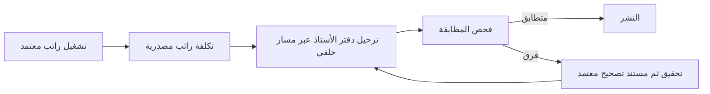

# سجل حوكمة — مطابقة الرواتب وحاجز الإصدار

## عقد البناء والترحيل

- **الهدف:** معالجة سبب فشل النشر من دون تجاوز رقابة مطابقة تكلفة الرواتب بدفتر الأستاذ، ثم إصدار تغييرات الموردين فقط بعد تحقق مالي وتشغيلي.
- **المستخدمون:** مالك النظام وفريق الرواتب والمحاسبة؛ لا يتأثر مستخدم واجهة الموردين بقرار معالجة الرواتب.
- **النطاق:** تشخيص فرق المطابقة المذكور في سجل النشر، تحديد المصدر الدفتري والوثيقة المصدرية، وتنفيذ التصحيح المعتمد القابل للتدقيق إن أثبتت البيانات سببه؛ ثم إعادة تشغيل النشر والتحقق من نسخة اللايف.
- **خارج النطاق:** تجاوز خطوة المطابقة، تعديل قيود مرحلة مباشرة في قاعدة البيانات، تغيير حسابات الراتب أو الرصيد من الواجهة، أو معالجة رواتب/شركات أخرى بلا دليل.
- **معايير القبول:**
  1. يحدد التحقيق قراءةً مصدر فرق تكلفة الراتب مقابل تكلفة دفتر الأستاذ، مع نطاق الفترة/الشركة/التشغيل المتأثرين.
  2. أي معالجة مالية تستعمل مسار تصحيح خلفي معتمد وتترك سلسلة التدقيق، ولا تحذف أو تعدل قيداً مرحلاً بصمت.
  3. يمر فحص `verify-payroll-ledger-reconciliation` بلا فرق بعد المعالجة، أو يوثق كعائق يحتاج سياسة محاسبية من المالك.
  4. يعاد النشر فقط بعد قرار تسليم مستقل، وتعود صحة اللايف بالإصدار المطلوب.
- **الافتراضات:** تفويض المستخدم يشمل إصلاح سبب حاجز النشر وإعادة النشر، لكنه لا يخول اختراع سياسة محاسبية أو تجاوز رقابة مالية. تبدأ جميع خطوات التحقيق قراءة فقط.

## دورة ERP والرقابة

- مصدر الحقيقة للأرقام: تشغيل الراتب وقيود دفتر الأستاذ في الخلفية/قاعدة البيانات؛ لا حسابات مالية في العميل.
- الرقابة: الفرق يوقف النشر، ولا يعالج إلا بعكس/تصحيح موثق أو بقرار محاسبي صريح إذا لم توجد قاعدة آلية آمنة.
- التزامن: يعاد الفحص مباشرة قبل النشر؛ أي محاولة تصحيح يجب أن تكون ذرية، محمية من التكرار، وقابلة للتتبع.

## ملف السعة والعمليات

- الرحلة الحرجة: فحص مطابقة الرواتب قبل النشر؛ قراءة دفعات وروابط دفتر الأستاذ، ثم كتابة تصحيح واحد فقط إن أثبت الدليل الحاجة.
- الحد: لا اختبار حمل ولا تصحيح جماعي على الإنتاج. النطاق تشغيلي محدود للعنصر الذي كشفه الفحص.
- الاستمرارية: النشر الحالي يبني الخلفية قبل إيقاف API ويعيد تشغيلها عند الفشل؛ بقيت الصحة متاحة بعد الفشل السابق. تحفظ أدوات التصحيح/السجل دليلاً قابلاً لإعادة الفحص.

## سجل البوابات

| البوابة | الحالة | الدليل المطلوب | قرار حارس البوابات |
|---|---|---|---|
| G0 | معتمدة للتحقيق | هذا العقد ودورة ERP وسجل فشل النشر ومراجعتان مستقلتان | التحقيق قراءة فقط مسموح؛ لا كتابة مالية |
| G1 | معتمدة للتحقيق | ملف السعة والحدود أعلاه | لا تغيير جماعي أو تحميل إنتاجي |
| G2 | معتمدة للتشخيص | خريطة مصدر الراتب ↔ القيد، وسيط استعلام read-only، ومنع التكرار في المسارات القائمة | لا تعديل بيانات قبل دليل ومراجعة مستقلة |
| G3 | معتمدة | استخدام الأدوات والسكريبتات القائمة بلا مكتبة أو رصة جديدة | المسار المباشر: أصلح مصدر الفرق لا بوابة النشر |
| G4 | غير منطبقة | لا تغيير واجهة | — |
| G5–G8 | غير مبدوءة | فحص/تصحيح/تحقق/مراجعة تسليم | — |

## دفتر العمليات الحي

| المعرّف | البوابة | النوع | النية | النتيجة والدليل | الأثر والتراجع |
|---|---|---|---|---|---|
| 001 | G0–G3 | توثيق | تسجيل فشل النشر والتحقيق المالي المنضبط | فشل workflow عند `verify-payroll-ledger-reconciliation`؛ API استعيد تلقائياً وبقيت صحة اللايف بالإصدار السابق | لا تعديل مالي أو نشر مكتمل |
| 002 | G0–G2 | قراءة | فحص سكربت المطابقة، نماذج الرواتب ودفتر الأستاذ، ومسار التصحيح المتاح | قيد التنفيذ | لا أثر |
| 003 | G0–G2 | مراجعة مستقلة | مراجعتان لمسار النقص ومسارات التصحيح القائمة | الفرق نقص تكلفة دفترية، بينما أدوات الإلغاء القائمة تعالج فائضاً فقط؛ يلزم جرد مصدر/قيد قراءةً قبل أي كتابة | لا أثر؛ منع استخدام أداة غير ملائمة |
| 004 | G2 | قرار | اعتماد تشخيص إنتاجي read-only على runner نفسه | يستعلم عن إجماليات المسير والسلف والقيود من دون أسماء موظفين أو معرفات أو أسرار، ويضبط جلسة PostgreSQL على read-only | لا كتابة؛ الفرع التشخيصي قابل للحذف بعد التحقق |
