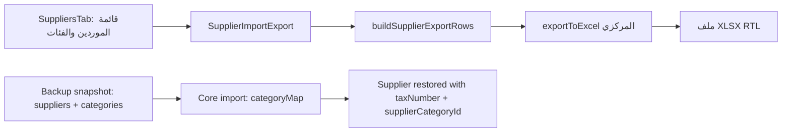

# سجل حوكمة البناء — تصدير الموردين والنسخ الاحتياطي

## عقد البناء

- **الهدف:** ضمان أن يشتمل تصدير الموردين الذي يفتحه المستخدم في Excel على الرقم الضريبي وفئة المورد، مع إثبات أن النسخة الاحتياطية المنطقية تحفظ وتستعيد الرقم الضريبي وحالة التسجيل الضريبي وفئة المورد.
- **المستخدمون:** مسؤول الشركة ومستخدمو إدارة الموردين المخوّلون بالتصدير أو النسخ الاحتياطي.
- **النطاق:** مسار تصدير الموردين، بياناته المعروضة، واختبارات التصدير؛ ومسار النسخة الاحتياطية المنطقية/الاستعادة واختباراته المتعلقة بالمورد. لا تغيير في قواعد احتساب ضريبة الفواتير أو بيانات الإنتاج.
- **خارج النطاق:** تغيير مخطط قاعدة البيانات، إنشاء فئات تلقائياً عند استيراد ملف موردين، تغيير إعدادات أو بيانات الإنتاج، وتبديل مكتبات التصدير.
- **معايير القبول:**
  1. ملف تصدير الموردين يفتح في Excel ويتضمن على الأقل الرقم الضريبي وفئة المورد لكل صف.
  2. لا تتراجع أعمدة المورد الحالية أو حماية CSV/Excel من حقن الصيغ.
  3. النسخة الاحتياطية المنطقية تحتوي `taxNumber` و`isTaxRegistered` و`supplierCategoryId`، والاستعادة تعيد الربط بالفئة الصحيحة داخل الشركة المستعادة.
  4. توجد اختبارات آلية تغطي أعمدة التصدير ولقطة/استعادة المورد ذات الصلة.
  5. تمر فحوص النوع والاختبارات المتأثرة قبل الرفع إلى `main`، ولا يُرفع شيء للايف قبل مراجعة فريق التسليم.
- **الافتراضات:** المقصود بـ«الفئة» اسم فئة المورد القابل للقراءة في ملف التصدير، ويُحافظ أيضاً على مرجعها في النسخة الاحتياطية. المقصود بـ«الضريبة» هو الرقم الضريبي وحالة التسجيل الضريبي على المورد، وليس حساب ضريبة فاتورة جديداً. ملف التصدير الحالي CSV يُفتح في Excel؛ سنقيّم استخدام مسار Excel المركزي الموجود من دون إضافة حزمة.
- **الرحلات الحرجة:** إدارة الموردين → تصدير → فتح Excel؛ شركة → لقطة احتياطية منطقية → استيراد كشركة جديدة → تحقق بيانات المورد والفئة والضريبة.

## خريطة دورة ERP والرقابة

| المجال | مصدر الحقيقة | التغيير المقترح | رقابة القبول |
|---|---|---|---|
| بيانات المورد | جدول `suppliers` في الخلفية | قراءة فقط للتصدير | لا تعديل لقيود أو أرصدة أو ضريبة فواتير |
| فئة المورد | `suppliers.supplier_category_id` مع `categories` | عرض اسم الفئة في التصدير | الاستعادة تعيد تعيين المرجع إلى فئة الشركة الجديدة |
| بيانات الضريبة | `suppliers.tax_number` و`is_tax_registered` | عرضهما في التصدير وتأكيد حفظهما باللقطة | لا احتساب ضريبي في العميل |
| النسخة الاحتياطية | لقطة منطقية خادمية | اختبار حفظ/استعادة الحقول | تحقق قبل تنزيل/استيراد النسخة الموجودة |

## سجل البوابات

| البوابة | الحالة | المالك | المراجع المستقل | دليل الدخول | قرار حارس البوابات |
|---|---|---|---|---|---|
| G0 الحوكمة والعقد | مقفلة | قائد البناء، محلل الرحلات، خبير ERP | مراجعان مستقلان لمساري التصدير والنسخة | عقد البناء وخريطة دورة ERP ومراجعتي المسار المستقلتان | معتمد: لا تغير مالي أو schema؛ النطاق قراءة/تصدير واختبار استعادة |
| G1 السعة والنمو | مقفلة | مهندس السعة | كبير المعماريين | ملف السعة أعلاه وملاحظة حد نتائج الموردين القائم | معتمد: لا تحميل أو تخزين أو عملية خادمية جديدة |
| G2 المعمارية والعقود | مقفلة | كبير المعماريين وبنّاء الخدمة | مهندس السعة وخبير ERP | مراجعة `suppliers`/`categories` واللقطة والمستورد | معتمد: الفئة تعرض بالاسم، واللقطة تظل المرجع القابل للاستعادة |
| G3 التقنية والمكتبات | مقفلة | أمين المكتبات | كبير المعماريين | `xlsx` و`exportToExcel` القائمان واختبارات المسار | معتمد: لا حزمة ولا رصة ولا ترحيل جديد |
| G4 التجربة | مقفلة | مصمم التجربة وبنّاء الواجهة | حارس الجودة | زر ومكوّن مركزيان موجودان؛ ملف `.xlsx` RTL بعناوين عربية | معتمد: لا شاشة أو مكوّن عام جديد؛ نفس الإجراء ببيانات أوضح |
| G5 الشريحة العمودية | مقفلة | بنّاءا الواجهة والخدمة | حارس الجودة وخبير ERP | اختبار Excel 3/3 واختبار لقطة/استعادة 1/1 | معتمد وظيفياً ضمن النطاق |
| G6 السعة المبكرة | مقفلة بقيود | مهندس السعة | حارس الجودة | تحليل حد الصفحة الحالي؛ لا اختبار حمل مصرح به | لا ادعاء بسعة 50,000؛ التصدير الحالي لا يثبت ما بعد حد خدمة الموردين |
| G7 البناء المتدرج | مقفلة | قائد البناء | حارس البوابات | `git diff --check` وبناء الواجهة واختبارات النطاق | معتمد مع ملاحظات P2 موثقة |
| G8 مرشح التسليم | مرفوض مؤقتاً | قائد البناء/التشغيل | فريق تسليم ألفا | مراجعة التسليم وفشل فحص النوع الكلي | لا رفع قبل commit محدد واستثناء صريح أو إصلاح موانع P1 |

## ملف السعة والنمو (G1)

- **الافتراض المحافظ:** حتى 50,000 مورد في الشركة؛ المستخدمون المتزامنون للتصدير أقل من 5؛ تصدير واحد يصل إلى 50,000 صف وحجم بضعة ميغابايت.
- **العملية الحرجة:** تكوين ملف التصدير في العميل من قائمة الموردين المحمّلة؛ يجب أن يبقى مسار التصدير محدوداً ببيانات الصفحة/النطاق الحالي أو يُعاد تقييمه إن توسع إلى جميع الموردين.
- **الأداء المستهدف:** بدء التنزيل خلال 10 ثوانٍ عند حجم متوقع؛ فشل واضح بدلاً من ملف جزئي عند بيانات غير صالحة.
- **التزامن والاستمرارية:** التصدير قراءة فقط. النسخة الاحتياطية العملية الخادمية الحالية تملك حالة مهمة وتحقق سلامة؛ لا تغير متوقع في حجم اللقطة بسبب حقول موجودة أصلاً.
- **الاحتفاظ والرصد:** لا تخزين جديد لملفات التصدير. تظل سياسة احتفاظ النسخ الاحتياطية الحالية المرجع.
- **حد القياس:** لن يشغّل الفريق اختبار حمل على الإنتاج؛ الاختبارات هنا وحداتية/محلية فقط.

## قرار المعمارية والعقود (G2)

- **المسار المباشر:** إعادة استخدام نموذج التصدير المركزي والمكتبة المثبتة (`xlsx`) بدلاً من إضافة اعتماد أو إنشاء خدمة جديدة. تُحل فئة المورد من قائمة الفئات التي تملكها شاشة الموردين، ويظل اسم الفئة للعرض فقط.
- **عقد التصدير:** صف واحد لكل مورد، مع الأعمدة الحالية والرقم الضريبي وحالة التسجيل الضريبي وفئة المورد. لا يُصدّر معرف داخلي كبديل وحيد لاسم الفئة.
- **عقد النسخة الاحتياطية:** تبقى اللقطة الخام للخادم هي مصدر الحقيقة. تصدّر `suppliers` و`categories`، ويعيد المستورد تعيين `supplierCategoryId` عبر خريطة الفئات الجديدة.
- **التزامن/الترحيل:** لا تغيير schema ولا ترحيل ولا عملية كتابة جديدة.
- **المخاطر:** التصدير CSV الحالي يفتقد فئة المورد وحالة التسجيل؛ تغيير صيغة الملف قد يؤثر في استيراد المستخدمين. الحل يجب أن يحافظ على مسار الاستيراد المتوافق أو يوضح الصيغة الجديدة واختبارها.

## التقنية والمكتبات (G3)

- **القدرات القائمة:** `xlsx` و`xlsx-js-style` مثبتتان، ويوجد `exportToExcel` مركزي في الواجهة.
- **البدائل:** CSV يدوي (قائم لكنه لا يحقق طلب Excel بصورة صريحة)؛ مكتبة جديدة (مرفوضة: لا حاجة)؛ خدمة خلفية جديدة (مرفوضة: لا توجد حاجة لبيانات إضافية أو تحكم وصول جديد).
- **القرار المبدئي:** استخدام القدرة المركزية الحالية إن أثبت الفحص توافقها مع ملف المورد؛ لا تثبيت مكتبات أو تعديل الرصة.
- **التحقق المتوقع:** اختبارات نموذج التصدير، اختبار الاستيراد المتوافق، واختبار النسخة الاحتياطية/الاستعادة ذي الصلة، ثم فحوص النوع.

## خريطة مرشح التسليم

المثبت: مسار التصدير في ملفات الموردين والقدرة المركزية؛ ومسار اللقطة/الاستعادة في `backup-company-export.ts` و`backup-logical-import-core-entities.util.ts`. لا توجد كتابة بيانات في التصدير.

## سجل القرارات

| القرار | البدائل | سبب المسار المباشر | الأثر | حالة المراجعة |
|---|---|---|---|---|
| عدم تغيير مخطط قاعدة البيانات | ترحيل حقول جديدة | الحقول موجودة بالفعل في المورد واللقطة | خطر نشر منخفض ولا حاجة لترحيل | قيد المراجعة |
| عدم إضافة مكتبة | مكتبة تصدير جديدة | `xlsx` ومسار تصدير مركزي موجودان | لا حجم/ترخيص/مخاطر جديدة | قيد المراجعة |
| فصل تصدير المستخدم عن النسخة الاحتياطية | دمج الاثنين في ملف واحد | التصدير قابل للقراءة والنسخة الاحتياطية تعافي موثوق بوظائف مختلفة | يبقى الاستيراد الآمن للنسخ المنطقية كما هو | قيد المراجعة |
| تحويل تصدير الموردين إلى XLSX | إبقاء CSV فقط | الطلب صريح لـ Excel، والمكوّن المركزي موجود؛ يبقى استيراد CSV متوافقاً | ملف قابل للقراءة في Excel ولا يغير النسخة الاحتياطية | معتمد |

## دفتر العمليات الحي

| المعرّف | البوابة | النوع | النية أو التغيير | النتيجة والدليل | الأثر والتراجع | المنفذ / المراجع |
|---|---|---|---|---|---|---|
| 001 | G0–G3 | قراءة | قراءة تعليمات فريق البناء ومراجع الحوكمة والسعة وERP والمعمارية | تم توثيق الشروط قبل أي تعديل تطبيق | لا أثر على التطبيق | قائد البناء / بانتظار المراجع |
| 002 | G0–G3 | توثيق | إنشاء عقد بناء وسجل بوابات وسعة وقرارات لهذا النطاق | `SUPPLIER_EXPORT_AND_BACKUP.md` | قابل للحذف/الرجوع عبر Git | أمين السجل الحي / بانتظار المراجع |
| 003 | G0–G3 | مراجعة مستقلة | فحص مسار تصدير الموردين ومسار اللقطة/الاستعادة بلا تعديل | التصدير CSV يضم الرقم الضريبي فقط؛ اللقطة والاستعادة تتعاملان مع `taxNumber` و`isTaxRegistered` و`supplierCategoryId` والفئات | لا أثر على التطبيق | مراجع التصدير ومراجع النسخ / حارس البوابات: معتمد |
| 004 | G4 | قرار | اعتماد استخدام `exportToExcel` المركزي وزر الموردين القائم | لا مكونات أو مكتبات أو نصوص عامة جديدة؛ Excel RTL بعناوين عربية | قابل للرجوع عبر Git | مصمم التجربة وبنّاء الواجهة / حارس الجودة: معتمد |
| 005 | G5 | تنفيذ مقرر | تعديل نموذج/مكوّن تصدير الموردين وإضافة اختبارات التصدير والاستعادة | بانتظار التنفيذ | قابل للرجوع عبر Git | قائد البناء / حارس الجودة: قيد التنفيذ |
| 006 | G5 | تنفيذ | تحويل تصدير الموردين إلى XLSX بالعناوين العربية وإضافة فئة المورد وحالة التسجيل الضريبي؛ حفظ الرقم الضريبي والهاتف كنص | الملفات المعدلة في مسار الموردين و`excelExportImport.ts` | لا تغيير schema أو بيانات؛ قابل للرجوع عبر Git | بنّاء الواجهة / رقيب الجودة |
| 007 | G5 | اختبار | تشغيل Vitest لنموذج تصدير الموردين وJest لاختبار لقطة/استعادة الضريبة والفئة | PASS: 3/3 للواجهة؛ PASS: 1/1 للخلفية | لا بيانات أو خدمات خارجية | حارس الجودة / خبير ERP |
| 008 | G7 | اختبار | تشغيل `npm run build` و`git diff --check` وفحص كتابة خلايا XLSX ذات بادئات الصيغ | PASS للبناء وفرق نظيف؛ الخلايا النصية تبقى `t: s` وليست صيغاً | مخرجات البناء محلية ومتجاهلة | حارس الجودة وحارس الأمان |
| 009 | G8 | مراجعة تسليم مستقلة | مراجعة الجودة والأمان والتشغيل للمرشح | NO-GO مؤقت: يلزم commit محدد؛ فحص النوع الكلي يفشل بأخطاء قائمة خارج النطاق؛ حد الموردين الحالي 200 يتطلب معالجة أو قبولاً موثقاً | لا نشر تم؛ القرار يحتاج استثناء P1 صريح أو علاج | فريق تسليم ألفا / قائد التسليم |
